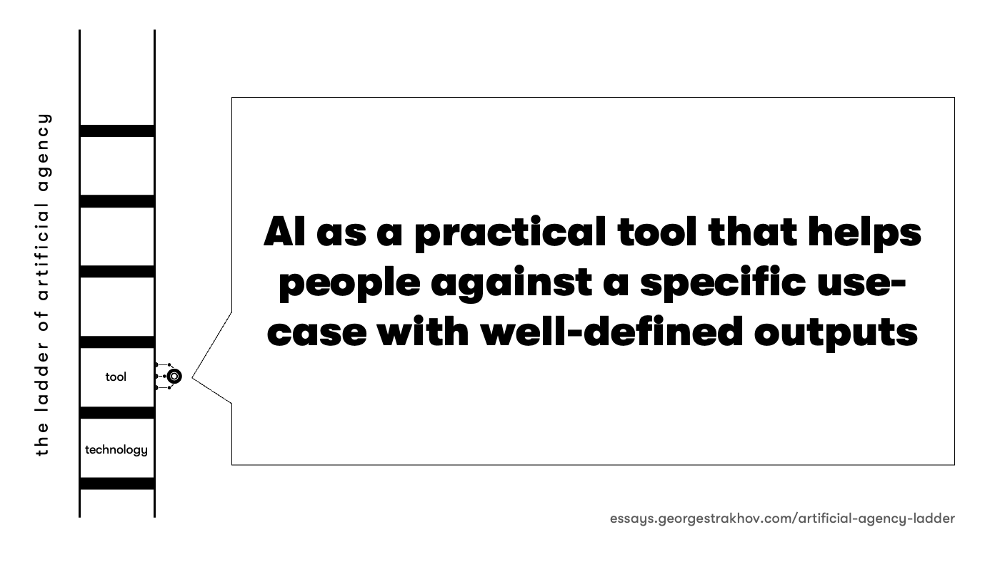

> "Civilization advances by extending the number of important operations which we can perform without thinking about them"  
>  Alfred Whitehead

As I write these words – or rather, as an AI assistant collaborates with a human author to write these words – we're engaged in exactly the kind of agency-sharing that this essay attempts to think through and classify. For 150,000 years, humans have prided ourselves on being the exclusive wielders of rational, deliberate agency in our world - or at least we liked to think so. Other forms of life have always exercised their own kinds of agency, from bacteria navigating chemical gradients to birds crafting elaborate nests and beyond. But we told ourselves our particular flavor of consciousness and decision-making was special. Now we're building artificial minds that can act with increasing autonomy, and the most interesting question isn't how intelligent they are, but rather what kind of agents we want them to be[^1].

To understand the different modes of artificial agency – the different ways that intelligence manifests as action in our world – we can imagine them arranged on a ladder. Not an evolutionary ladder (these modes coexist and always will), but rather a ladder of agency distribution: how much of the total agency in any given action stays with the human, and how much transfers to the artificial system[^2].

## 1. Technology

At the bottom rung, artificial intelligence operates as pure technology – shaping our world from beneath the surface of awareness, like electricity running through the walls of your house. The human retains almost complete agency (or at least a sense of it), while the technology amplifies their capabilities tremendously. When autonomous trading algorithms follow the overall guidance of the human trader and adjust market positions microsecond by microsecond, they're not really making the important choices – they're expressing the crystallized intentions of their human operator, magnifying their will to act at the speed of inaccessible to mere humans[^3].

## 2. Tool

One step up, we find AI as a genuine tool – and here we must be precise, because "tool" is perhaps the most misused word in discussions about AI. A hammer is a tool because its agency is nearly zero; it does exactly what the human wielder intends (if the user has the right skills), only imposing constraints, no more and no less. Most of what we casually call "AI tools" today aren't really tools in that sense – they have too much agency of their own. A pencil is a tool. An image generation software is more than a tool, because too many decisions are made by the software itself. A spell-checker is a tool. An AI writing assistant that can "continue in the style of Hemingway" is something else entirely. The boundary is blurry here and the same technology can be used at different levels of the ladder, depending on the context. The distinction becomes clearer when things go wrong. If a hammer breaks while you're using it, you don't wonder about its intentions or motivations. But when an AI writing assistant produces unexpected output, we often find ourselves questioning its "understanding" or "goals."

## 3. Temporal Lobe

The third level is where agency begins to really blur: AI as a cognitive prosthetic that doesn't just extend our capabilities but shapes how we think and remember. AI-assisted language processing (e.g. when you ask AI to summarize before you read a long paper), memory and attention really means that the thinker has become genuinely inseparable from the system. Like our temporal lobe, these systems gradually become inseparable from our cognitive processes. When a researcher uses an AI system to explore connections across thousands of papers, the resulting insights aren't purely human anymore – they emerge from a hybrid dance of agencies.

## 4. Team Member

At the fourth level, AI becomes a distinct agent with its own domain of competence within a primarily human process. Like that brilliant but slightly odd colleague who nobody quite understands but everyone relies on. This is where we sit right now, dear reader – this essay is being crafted through a collaboration between a human author (George) and an AI assistant (Claude) who brings its own perspective and capabilities to the table while remaining part of a human-led creative process[^6].

## 5. Team

The fifth level is where artificial agents work together, forming autonomous units within human organizations. Imagine a corporate research department where AI agents collectively handle literature review, experimental design, data analysis, and paper drafting – while humans focus on asking the right questions and making strategic decisions. The artificial team has significant agency in how the work gets done, but the fundamental direction still comes from humans[^7].

## 6. Trustee / Target

At the top of our ladder sits the most provocative form: AI as an autonomous trustee making consequential real-world decisions without detailed human oversight. Here, humans have delegated significant agency to the artificial system. Imagine an autonomous enterprise, where humans are shareholders and are on the board, but both the CEO and all the workers are AI agents. Or it could be much simpler: an AI assistant making purchase decisions on behalf of a human and actually executing the purchase - something that is already happening in the most advanced AI assistant agents. This creates a fascinating duality – the system becomes both a trustee (the user surrender their agency to it) and a target audience (when sellers attempt to influence the purchasing decisions - they have to influence the AI rather than the human on whose behalf the purchase is made)[^8].

## The Ultimate Design Question

The ladder of artificial agency gives us six distinct levels or modes of agency distribution between human and AIs: technology (1), tool (2), temporal lobe (3), team member (4), team (5), and trustee/target (6). Like any model, it's a crude simplification of a much more fluid reality. Agency rarely fits into neat categories – it flows and shifts, often occupying multiple levels simultaneously. But even an imperfect model can help us think more clearly about the choices we face.

Because ultimately, this is about design – about consciously shaping how work gets done and decisions get made. Each level of artificial agency creates different affordances: different possibilities for human engagement and different paths for system evolution. When we let AI operate as pure technology, we gain efficiency but risk losing touch with the underlying processes. When we employ it as a tool, we extend our capabilities but must focus on the skills needed to guide it. When we accept it as a cognitive prosthetic, we amplify our mental abilities in some ways, but may become dependent on its support in other ways. Each level up the ladder offers new possibilities while foreclosing others.

The fundamental question isn't just what level of artificial agency we want our AIs to exhibit – it's what we as humans want to keep thinking about and deciding for ourselves, and what we're willing to delegate and eventually forget. Because delegation almost invariably brings the risk of atrophy. Skills we don't use wither. Understanding we don't maintain fades. Agency we don't exercise diminishes. What is the agency we want to keep? What agency do we want to delegate and at what cost?

---

_By George & Claude_  
_Amstelveen, 020250108_

---
### footnotes

[^1]:
     The question of agency distribution isn't merely theoretical. Every time you use a navigation app, you're making a choice about how much agency to delegate.

[^2]:
     Consider a near-future hospital operating room. In a single space, you might find AI operating at all six levels simultaneously: from pure technology managing equipment parameters, to tools extending surgeon capabilities, to cognitive prosthetics helping process patient data, to team members suggesting diagnosis, to autonomous teams managing anesthesia, to trustees making split-second decisions in critical moments where human agency is simply too slow.

[^3]:
     Though even at this level, the distribution of agency isn't always clear. When a collection of trading algorithms creates an unexpected market flash crash, whose agency was really expressed?

[^4]:
     This hybrid agency is particularly visible in creative fields. When an artist uses AI image generation iteratively, gradually refining outputs, who is really making the artistic decisions? The line between tool use and cognitive extension becomes increasingly blurred.

[^5]:
     A fascinating example comes from the field of drug discovery, where AI teams now increasingly handle everything from initial compound screening to predicting protein interactions to designing synthesis pathways. Humans still decide what diseases to target, but the discovery process itself is rapidly becoming more and more autonomous.

[^6]:
     The duality of trustee/target status creates interesting dynamics. Consider an AI system managing a city's traffic flow. It's a trustee of public safety and efficiency, but also becomes a target for various stakeholders trying to influence its behavior – much like a human traffic commissioner would be.
