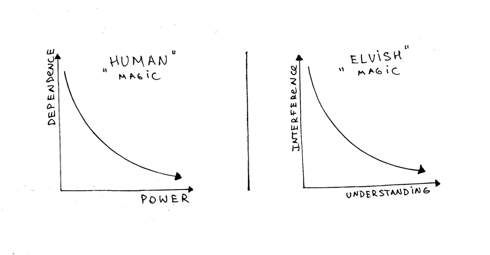
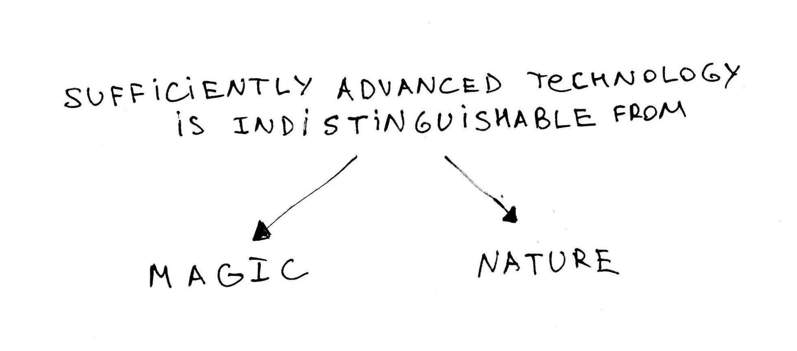
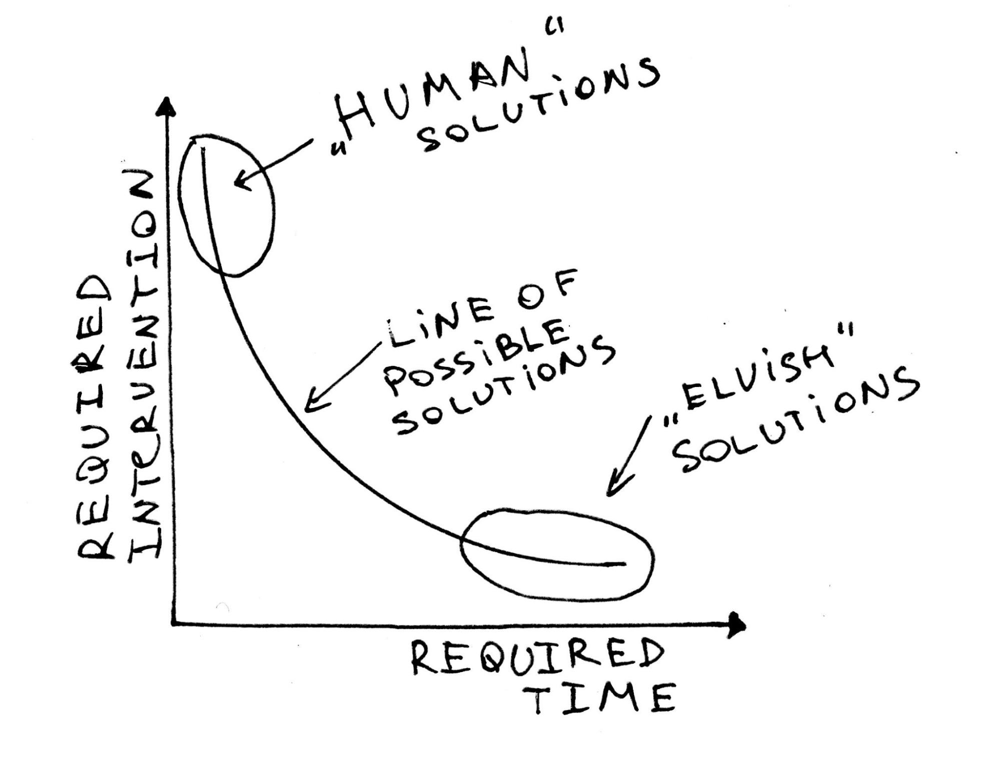

# Towards a more Elvish vision for Technology

---

> For Gavin, 020210703

There are at least two kinds of magic. These two kinds may not always be distinct in their appearance, but are very different in their underlying motives and their ultimate outcomes[^1].

The first kind of magic, which we shall call “Human”, is driven by the desire to extend one's power over the world, while simultaneously minimizing one's dependence on the world. The ultimate outcome of this pursuit is world-amputation: the destruction[^2] of the world on which one no longer depends.

The second kind of magic, which we shall call “Elvish”, is driven by the desire to extend one's understanding of the world, while simultaneously minimizing one's intentional interference with the ways of the world. The ultimate outcome of this pursuit is self-amputation: the dissolution of the self and becoming one with the world.

The “Human” magic of conquest and control has had many names over the centuries, but today we call it "technology", and we use it quite successfully both as a shield from nature and as an axe with which we can cut, shape and subdue it to our will. In the 1950s J.R.R. Tolkien used the words "Magic" and "Machine" interchangeably, as long as the underlying motive was "the desire for Power, for making the will more quickly effective"[^3]. A decade later, Arthur C. Clarke famously declared that "sufficiently advanced technology is indistinguishable from magic"[^4], in effect, cementing a program for the coming generations of engineers: building machinery for making human will so quickly effective that the constraints and boundaries of the natural world cease to exist (which inevitably leads to the natural world itself gradually disappearing, as nothing can exist without its boundaries and its friction). The strategies for removing the friction of the world are many — from robotic extensions to virtual-reality amputations — but the side-effects are often the same: if we want to minimize the world’s friction, we also have to minimize its power. 

Both kinds of magic are partially known to humans[^5], but for most of known history, we've been primarily obsessed with the first kind. Since the beginning of time we have been endlessly looking for ways to conquer, control, or separate ourselves from what was outside of our power. In fact, one can view the whole history of human civilization as a story of gradual increase in our insulation from nature: technology is humanity’s fur.

Gaining power over fire was the first mythical act of this kind of magic (thus Prometheus is its archetypal hero[^6]). Since then we have made a lot of progress: we have learned to control light, pain, heat, food, energy and information well enough to achieve a significant degree of independence from our environment[^7].

The final uncontrollable entity that needs conquering is death. Mastering death has been the ultimate quest for many generations of the practitioners of “Human” magic, from the first Emperor of China, who died as a result of drinking what his alchemists thought was the elixir of immortality, to the current researchers looking for ways to break through the Hayflick limit[^8].

Our obsession with putting others to death could be understood as a subconscious coping mechanism that, in a perverted way, helps us compensate for the fact that we can't yet control our own death fully. After all, if we can't master death in a way that would forbid it from coming to ourselves, we can at least feel like we are its masters by making it come to others when we bid it so[^9]. Such is the magic of the mortals: searching for power that can conquer death, and, almost inevitably, creating more death along the way.

But what if death was not a problem? What technologies would immortals be interested in?

One natural hypothesis is that they, like us, would point their magic towards the only thing unavailable to them: in our case, immortality in their case,- death, and in either case, the complete dissolution of the Self. So if the final destination of the mortals is suicide by conquest, then the final destination of the immortals is suicide by understanding. Deep understanding always implies self-amputation, either by way of making oneself “an outside observer” (the scientific way) or by realizing complete interconnectedness and oneness with the world and inseparability of the Self from it (the spiritual way). When the dog discovers its Buddha’s nature, it stops being a dog.

And while Tolkien’s Elves are not completely enlightened in the Buddhist sense, still, understanding, beauty and harmony are what they seek the most. They are in love with the world and its music[^10], and so, through knowledge, observation, crafts and arts, they are trying their best to help the world grow and evolve… for which their best strategy is getting out of the way of this evolution. The “fading” of the Elves is the feeding of the world. When the music's over, turn out the lights[^11].

So, if for Humans “sufficiently advanced technology is indistinguishable from magic”, then for the Elves, “sufficiently advanced technology is indistinguishable from nature”[^12] (for them the more advanced magic is the one that allows nature to be most uninhibited). This, however, is not biomimicry. The Elves do not imitate nature, they let nature do its magic and try to help it as best as they can. Allowing nature to solve a problem is extremely effective and efficient. The only downside is that it usually takes a lot of time - precisely the thing that the immortals have plenty of.

Give it enough time, and every problem will solve itself. This may not always be a practicable strategy for a mortal, but it doesn’t mean that we have to always go to the other extreme. Solving a problem instantly requires an infinite amount of energy, and an equally unthinkable number of side-effects. Fixating on solving the problem quickly and by our own action (rather than pointed inaction) results in our potential solution space being reduced to very few options.

One can think of “Human” and “Elvish” kinds of technology as two opposite evolutionary strategies for a conscious being: the first one minimizes surprise (or, more precisely, free energy[^13]) by adapting the world to one’s predictions and desires of the world; the second one minimizes surprise by adapting one’s predictions and desires to the way the world is[^14]. The second (“Elvish”) strategy may sound passive, and in that way inferior or defeatist, but it isn’t. Allowing the problem to solve itself is frowned upon and not even considered to be “real solving” by most humans: “And what did you do? What was your role? How did you save the world?” Humans (at least, us in the modern West) are obsessed with their own sense of agency. Everybody wants to save the world these days, but nobody seems to be interested in doing it slowly, by allowing the world to save itself, even if it is the most effective and efficient solution. Hesse’s Siddhartha isn’t joking when he is saying that all he can do is “think, wait and fast” and it is quite enough to accomplish almost anything[^15]. Slow is good, not just because it takes less effort (often it doesn’t), but because it achieves what it was meant to achieve.

At the beginning we said that the ultimate outcomes of “Human” and “Elvish” ways are different. But how different? And on what kind of time horizon? If practiced to their extreme, both may actually lead to fairly similar final outcomes. Look, for example, at a common utopian[^16] vision of the future: we have evolved into a disembodied, interconnected higher consciousness[^17], roaming the vastness of space, sustaining itself on nothing but pure energy (light). This could be seen as the ultimate destination for the “Human” technology, as it represents the most effective use of resources to fight off mortality (and all our Earth’s resources are probably by then used up and even the Sun is trapped in a Dyson sphere). However, a very similar picture could be the ultimate destination for the “Elvish” technology: we have cut ourselves off from the Earth and so it is left alone to flourish. We no longer interfere, and cease to exist individually, while collectively possessing ultimate understanding.

The big question, then, is not whether we should keep practicing “Human” magic or switch to “Elvish”. The big question is whether we have to choose outright between the “Human” and the “Elvish”, between perpetrating death and practicing death, between suicide by world-amputation and suicide by self-amputation. Perhaps a middle path is possible (for some of us in Middle Earth). In other words, can we develop and practice our magic in ways that would destroy neither the world, nor us[^18]? Hope mandates a positive answer. Because if these two extremes are our only options, then the choice is but a choice of the road, for the destination is the same, and not entirely pleasant (at least, not to my taste).

When hope mandates possibility, imagination springs to action to define this possibility in concrete terms. So let us now shift our mode of discussion from poetic to pragmatic and imagine what we would do differently if we rebalanced our practice of magic from almost[^19] exclusively “Human”, to a more even mixture between “Human” and “Elvish”. This shift would give birth to a new mode and a new method of problem solving. Three high-level features of such a method come to mind:

1. **Outcome is not a state, but a process**.
As mortals, we are used to time-bound problems and finite solutions. For example, the problem is that you have nowhere to live starting next month, the task is to build a house, the outcome of the work is that the house is built. Now you have somewhere to live. Job done.  But in a more “Elvish” paradigm, however, the moment the house is built is not the end. How will this building grow? What other purposes will it satisfy in the future? When and how will it be deconstructed? What would happen with the earth on which it is built? All these “Elvish” questions[^20] (and many more) can help develop a deeper understanding of both the problem and the solution spaces, and reframe (re-timeframe) both. The moment when the house is needed is not the end, but it is also not the beginning. How did the need for the house emerge? Where did the materials for it come from? When even starting to consider all this, our “Human” eyes start to glaze over: after all, we are looking for a place to live, not for a philosophical treatise. But this is short-sighted. Knowing why you need a house next month and how it plugs into the overall pattern of your life (and the life of the planet) is going to help you build a better house: a house that will be more comfortable to live in, but also that will not lose its purpose when you no longer need it. Such a house will, in its own right, become a part of the growing, learning, adapting world. Adopting a less mechanical and more of an agricultural metaphor can make this mental leap easier: what if instead of _building_ houses[^21], we _grew_ them?

2. **Resources are not materials, but agents**.
As humans, we like to throw resources at problems: money, people, concrete, whatever it takes. How many people will it take to solve this in five days? How much concrete do we need to close this gap? We tend to think of resources as materials: we use them, we apply them. We are the subject, the resources are the object. We are the active agent, the resources themselves for us are mostly passive. But from a more “Elvish” point of view, there is no such thing as a passive resource[^22]. There are no materials, only agents (of which we represent one group), and they interact with the environments in which they happen to be placed (by us or by chance). Some agents, like concrete, interact slowly and are more inert. Other agents, like humans, interact more quickly and are more obviously dynamic. But all resources are active. Money, if we throw it at a problem, will not just help solve it, but also change the people around it along the way (which may create new problems). New people, if we drop them into an organization, will make their own decisions, their own friends and enemies, their own adaptations, and will influence the overall culture. Even concrete has a mind of its own: it will stand there forever, it will invite mold to grow on it, it will influence the aesthetic of the place, it will put people around it in a certain mood. The difference in perspective here may feel subtle, but it’s not. When you are solving with materials (the “Human” way), you tend to think about the qualities of these materials. When you are solving with agents (a more “Elvish” way), you tend to think about their behaviors over time. If we plant this person (or a tree, or a concrete block) into this system, what will happen? What will this agent _want_ to do? How will it interact with other agents over time? What kind of agent do we need to plant here, so that in the pursuit of their own objectives and natural predispositions they will tilt the overall system in the direction that we want it to go[^23]?

3. **Information is not just an input, but an output as well**.
As problem-solving operators, we tend to seek a lot of information about the current state of the system that we are trying to fix. We try to maximize our understanding _before_ we make a decision on how to intervene. We learn so that we can act. But from a more “Elvish” point of view, the relationship between action and understanding is more symmetrical: we act so that we can learn, as much as we learn so that we can act[^24]. But how often do we think of “expected learnings” from a project (which is not a research project in the first place), rather than just a set of expected outcomes?
This quick sketch of a more “Elvish” vision for technology is neither complete, nor detailed. But it can serve as a first indication of how our practice of magic could be rebalanced and reimagined. And it is in need of reimagining, because the current way is leading us to its logical outcome of world-amputation at a much higher pace than we may realize. And the more we apply the same approaches to bigger problems, the more this spiral will accelerate[^25].

But even more importantly, our approach to technology needs to change because _we_ have changed. We are much more like the Elves than we used to be, and our powers for understanding have grown. Our lifespans have expanded. And as we are evolving into the Elves, our practice of magic needs to evolve as well. As Konrad Lorenz noted: “When, in the course of its evolution, a species of animals develops a weapon which may destroy a fellow member at one blow, then, in order to survive, it must develop, along with the weapon, a social inhibition to prevent a usage which could endanger the existence of the species”[^26]. This applies not only to weapons, but to all technologies (for any magic can be used as a weapon). The explosion of our technological powers needs to be accompanied by the shift in our technological paradigm. If we are turning into gods, we _have_ to get good at it[^27]. This should not wait till we become immortal. In fact, one could argue that the first step to becoming truly immortal is to start acting as if we already were.

---
#### footnotes

[^1]:
     When we take a closer look in a few pages, the difference in the outcomes may appear less drastic.

[^2]:
     Destruction may come in many forms. One of them - subsuming, or eating the world is a basic human instinct.

[^3]:
     J.R.R. Tolkien, Letter 131 to Milton Waldman (~1951)  ([https://www.tolkienestate.com/en/writing/letters/letter-milton-waldman.html](https://www.tolkienestate.com/en/writing/letters/letter-milton-waldman.html)) 

[^4]:
     Carke’s Three Laws: [https://en.wikipedia.org/wiki/Clarke%27s_three_laws](https://en.wikipedia.org/wiki/Clarke%27s_three_laws) 

[^5]:
     Ancient Greek's distinction between Techne, Episteme and Poiesis is similar, but not the same.

[^6]:
     Note, also, Prometheus’ severe punishment for disseminating the power. 

[^7]:
     This independence may be illusory. For the less we depend on nature, the more we depend on technology itself. It is no coincidence that as technology becomes more advanced, we tend to attribute to it a sense of agency, saying “Technology wants X”.

[^8]:
     The number of times a normal somatic, differentiated human cell population will divide before cell division stops ([https://en.wikipedia.org/wiki/Hayflick_limit](https://en.wikipedia.org/wiki/Hayflick_limit))

[^9]:
     Suicidal instinct, so common and yet so rarely discussed, can be explained similarly. Stevie Smith used to say that death is “the only god who must come when he is called”.

[^10]:
     It is no coincidence that the world _is_ music in Tolkien’s mythology. Any creation myth must deal with the fundamental question of how one becomes many. And if your world has to remain somewhat meaningful, despite the fall and somewhat harmonious, despite the dissonance, then musical metaphor is a very natural one.

[^11]:
     Jim Morrison (1967)

[^12]:
     Karl Schroeder, "The Rewilding: A Metaphor" ([https://www.youtube.com/watch?v=qb7pkohj6wE](https://www.youtube.com/watch?v=qb7pkohj6wE))

[^13]:
     Hereby referring to Karl Friston’s free energy: [https://en.wikipedia.org/wiki/Free_energy_principle](https://en.wikipedia.org/wiki/Free_energy_principle) 

[^14]:
     So, in the normal range of effectiveness, Magic maximizes surprise, but its final goal is to minimize it.

[^15]:
     Kamaswami: "And what's the use of that? For example, fasting -- what is it good for?"
    Siddhartha: "It is very good, sir. When a person has nothing to eat, fasting is the smartest thing he could do. When, for example, Siddhartha hadn't learned to fast, he would have to accept any kind of service before this day is up, whether it may be with you or wherever, because hunger would force him to do so. But like this, Siddhartha can wait calmly, he knows no impatience, he knows no emergency, for a long time he can allow hunger to besiege him and can laugh about it. This, sir, is what fasting is good for."
Kamaswami: "You're right, Samana. Wait for a moment." (Hermann Hesse - Siddhartha, 1922)

[^16]:
     Or Dystopian, depending on your taste.

[^17]:
     Brains in vats or minds on silicone - doesn’t matter for our current discussion.

[^18]:
     Or, more precisely, magic that would not unnecessarily accelerate either the destruction of the world or our own annihilation.

[^19]:
     “Elvish” technology is not completely absent from our current practices, as, for example, the Permaculture movement demonstrates.

[^20]:

     For a comprehensive overview of this kind of thinking applied to buildings, see Stewart Brand - “How Buildings Learn" (1994)

[^21]:
     Same applies not just to houses, but to anything that we build: systems, software, societies etc.

[^22]:

     Opposite interpretation equally possible. You could say that for the Elves, everything, including the Elves themselves is just material, and the only agent is Nature / Eru Ilúvatar.

[^23]:
     This methodological approach seems to have been known to many traditional cultures (e.g. Native American), but is now only beginning to be re-discovered.

[^24]:

     In one of his many moments of Zen-like insight, William James wrote: “Who can decide offhand, which is absolutely better, to live or to understand life? We must do both alternately and a man can no longer limit himself to either than a pair of scissors can cut with a single one of its blades” (William James - Percept and Concept, Some Problems of Philosophy, 1921)

[^25]:
     Note, for example, the language that is currently being used in connection to the climate change problem: “We need to fix it”, “Our target by 2050” ...etc. - arrogantly assuming that we are the only active agent in this system and that we can fix things by action, rather than by understanding.

[^26]:
     Konrad Lorenz - King Solomon’s Ring (1952)

[^27]:
     "We are as gods and might as well get good at it" (Stewart Brand, Whole Earth Catalog,1968)
