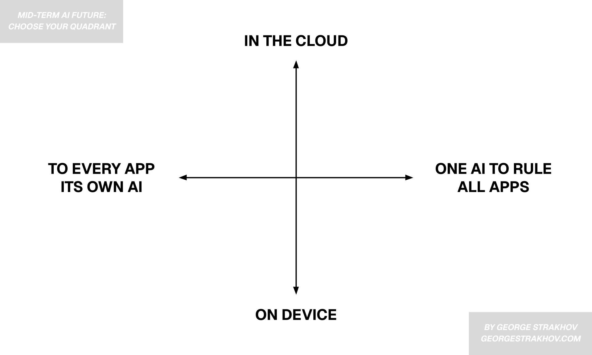
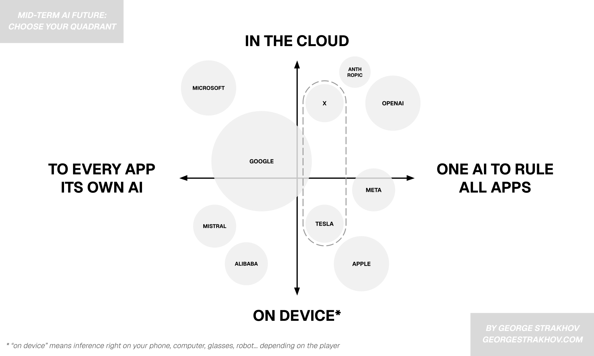
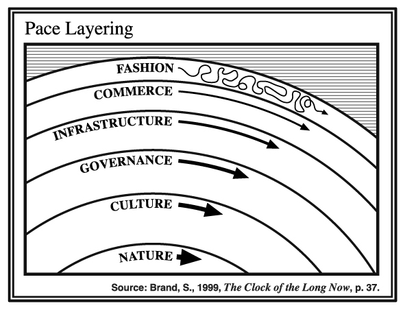

I have no idea what the longer-term future of AI, software, humans, robots, and the world at large has in store. And I don't believe anyone else knows with any degree of certainty.

But the mid-term future of AI software, and the user experience around it, is starting to get a little clearer. Not in terms of exactly where things will go, but at least in terms of where they could go. Not the final destination, but at least a map of the possible terrain.

Before we lay out the map, we need to understand the tectonic forces shaping it. The entire AI landscape is being pulled in two different directions along two main axes of tension.

### Axis 1: Where will AI live? The Cloud vs. The Device

The first major tension is about the physical location of AI computation.

On one end of the spectrum, you have **The Cloud**. This is the world of brute-force computation, exemplified by massive, multi-billion dollar data centers like ("Project Stargate" etc.) It's a future powered by enormous, centralized models that require immense energy and capital to both train and run but offer unparalleled scale and power.

On the other end, you have **The Device**. This future is driven by finesse and efficiency. Thanks to breakthroughs in quantization, the development of tiny yet powerful Vision Language Models (vLLMs), and the relentless march of Moore's Law, it's now (almost) possible to run a GPT-4o level model locally on a high-end smartphone. This approach promises superior privacy, offline availability, and zero-latency interactions.

### Axis 2: How will we interact with AI? One vs. Many

The second critical tension is about the user experience paradigm.

On one side is the vision of **One AI to Rule Them All**. This is a UX paradigm where the user primarily interacts with a single, universal AI assistant (like ChatGPT). You tell the AI what you want, and it orchestrates other apps and services in the background to get it done. The individual apps become invisible, abstracted away by one conversational interface (which integrated various contexts of your life and has memory etc).

Opposing this is the future where **Every App Has Its Own AI**. This is the "copilot" model, seen in sidebar interfaces like Cursor or integrations built with tools like CopilotKit. Here, the AI is a collaborator within a familiar application. The key advantage is shared context; the human and the AI see the same screen, work on the same data, and the user can seamlessly switch between direct manipulation and AI assistance.

With these two axes defined - Cloud vs. Device and One AI vs. Many - we can now create a clear map with four distinct quadrants for the future of AI.

Looking at this map, we can see major players making their bets on where the future should go. While most have projects across the spectrum, their strategic center of gravity - their most likely path to market dominance - can be placed in one of these quadrants. Some are spreading their risks, but others are going all-in on a single-quadrant future.

**Apple** is the easiest one to place. Being at its core a hardware company, they are betting on (and working towards) the future where AI runs on-device. They can wrap this into compelling privacy and offline availability stories. They can also sell a lot of really expensive hardware (both desktops and phones) as a result.

**Meta** is a little harder to place (perhaps because they don't really know themselves), but it seems they have not been very successful at the cloud and foundation models game. However, Zuck's metaverse ambitions and the doubling down on hardware with Ray-Ban indicate that they see the future as more on-device (their goggles in this case). They would like to own the primary interface (voice + touch), because that would allow them to own the user.

Next up is **OpenAI**. Altman's bet on the cloud is clear, at least for now. And even their upcoming move into hardware with Ive is likely to be a thin client. Computer use, scheduled agents etc. make it clear that OpenAI's vision is one where the user doesn't really touch anything else. They just tell ChatGPT what to do, and it does it for them.

**Anthropic** seems not far from OpenAI's position, though they seem slightly less hell-bent on the "one AI to rule them all" game, as their partnerships with Cursor and others show. They seem more interested in developing the best foundation models that can be used both as an interface to the world and as an underlying component for other experiences. Recently, Anthropic has been pushing its own "last mile" much more with native integrations, but it's unclear if they are all-in on becoming the Sauron of AI.

Next up is **Google**. As usual, it is too large to take one clear bet. They have amazing strength in TPUs, so they are definitely in the cloud game. Many Google apps are getting integrated AI capabilities. But judging by the latest Firebase releases, they are no strangers to the idea of on-device AI and, being the owners of Android, they would be foolish if they didn't go there. One thing Google seems less committed to is making Gemini the only interface into everything. This may be strategic, or it may be that they are just too big to execute this sharply.

**Microsoft's** main bet, on the other hand, seems easier to place. Apart from their stake in OpenAI, their primary hold on the world is Windows, Office, and Big Corporate Contracts. With these cards, their winning path is to embed AI copilots into their existing apps, pulling corporate clients deeper into the Azure ecosystem with private, firewalled models.

And then there's **X and Tesla** – Musk's constellation of companies that defy easy categorization. The dashed circle on our map reflects genuine uncertainty about their trajectory. Tesla has made massive investments in on-device compute for Full Self-Driving, with each vehicle essentially a rolling data center. Yet they're also building Dojo, a supercomputer infrastructure that rivals the biggest cloud players. Meanwhile, X's Grok runs in the cloud but serves Musk's vision of a singular "everything app." The truth is, Musk might be playing an entirely different game – one where the distinction between cloud and device becomes irrelevant because Tesla cars and Optimus robots become mobile nodes in a distributed compute network. And with Neuralink - you could be a node in that network of distributed superhuman collective intelligence too. Exciting. Scary. And far away. Let's get back to the map.

There are lots more players, of course, but it would take a book to cover them all. Broadly speaking, smaller labs (like Mistral) and big Chinese players seem (at least for now) committed to a more decentralized future, publishing small open models, with inference providers like Groq delivering these models to the world.

### But what about us?

This covers the big players' bets on the future. But what about the little guy? What about someone who is planning their career or starting a company today? It seems that the little guys need to make some bets as well.

For example, if you are building a B2B project and bet on the **Top-Right corner** (cloud-based, one AI interface), then you shouldn't be building for human users at all. You should assume your actual user will be an AI agent, and you need to ensure that agent chooses you and gets the best results out of you. Clean APIs, well protected and organized MCPs, shared rewards systems etc. are more important than human-level UX (there is probably a new design discipline emerging here: AX - agent experience. But that's a topic for another essay).

Or, if you are starting a B2C project, like an AI fitness coach, and you believe the future is on-device and domain-specific (**Bottom-Left corner**), you can justify aggressively acquiring users now with negative unit-economics, wasting tons of money on tokens. This could make sense if you can bank on the fact that soon user's devices will do the heavy lifting, and your subscribed users will become almost pure profit (like in the good old days of software that you only had to build and maintain but not pay for running continuously).

The **Top-Left corner** (cloud-based, many AIs) is perhaps the most crowded but also most immediately profitable. This is where specialized enterprise tools thrive – AI for legal research, medical diagnosis, financial modeling. Each tool goes deep rather than broad, and the cloud provides the computational muscle for specialized tasks. The key here seems to be owning a workflow (and the data associated with it) so completely that even when the "one AI" players come knocking, customers can't imagine switching.

The **Bottom-Right quadrant** (on-device, one AI) might seem like Apple's exclusive domain, but it offers opportunities for those building privacy-first, personal AI experiences. And yes, you can build it today even as a small startup, check [Cactus](https://cactuscompute.com) for example.

In reality, the future will probably look like a little bit of everything for a while. The closest parallel to what we are seeing with AI is electrification at the beginning of the 20th century. Electrification of the West took about 70 years (from first commercial uses in 1880s and 1890s to the nearly universal use in every home and factory by the 1960s). AI can go much faster, but humans, legal practices, habits, manufacturing, education and trust are still slow. So I bet we are still talking decades, rather than months.

{style="width: 100%;"}

In the meantime, every builder and investor is invited to place a bet on a quadrant of the future map. And while the long-term reality will likely be a blend, the dominant platforms and value chains of the next decade(s) will be forged by those who choose their quadrant wisely today.