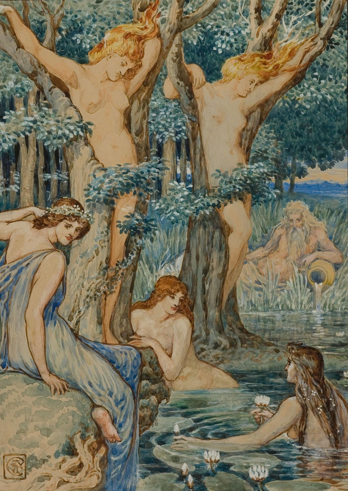
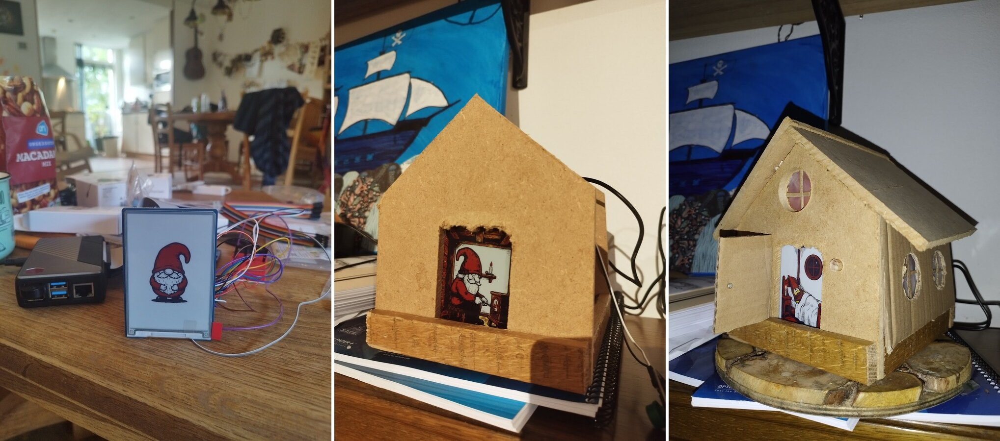

([Nyads and Dryads](https://commons.wikimedia.org/wiki/File:Walter_T._Crane_-_Nyads_and_Dryads.jpg) — Walter Crane, watercolour, date unknown){.gs-figure-description}

In his book "Superintelligence" (2014), Nick Bostrom outlined four likely "castes" or "species" of ASIs (artificial superintelligences): Tools, Oracles, Genies and Sovereigns. Tools have no agency of their own, but they get things done for us. Oracles know everything but don't act autonomously - people listen to them and trust their guidance without necessarily understanding their logic or inner workings. Genies act on behalf of individual humans and grant them wishes. Sovereigns have their will untethered from that of individual humans and rule over the Earth according to their own unknowable principles, plans and policies, as (hopefully) benevolent "machines of loving grace".

It's been 12 years since the book came out, and today, between 2 and 3 billion people have Tools and Oracles in their pockets. And some of us are starting to have genies in the form of Claude Code, OpenClaw and Grokbot-like autonomous agents that grant us wishes. The scope of these wishes is narrow but rapidly expanding as the agents gain financial instruments and physical actuators. At the same time, two of the most advanced AI labs on the planet are driving towards the rest of Bostrom's vision at breakneck speed. OpenAI's Sam Altman has said that they are building genies for everyone (not just for geeks) and that people better make sure they have a long list of wishes prepared. The company's upcoming hardware device is essentially Aladdin's lamp, and the Genie is a nearly omnipotent slave to the lamp and by extension to the lamp's owner. Anthropic's Dario Amodei is a bit more ambitious on the Bostrom scale. He believes that Anthropic may be the only company left in the world at some point, while some commentators have reported that inside Anthropic there is a deep sense that they are "midwifing a deity".

Whether the labs' ambitions are justified or delirious is beyond the scope of this essay. What I'd like to do here is propose a new possible species of ASI that Bostrom hadn't accounted for and that could present an alternative north star for those of us who have not yet forgotten our myths and fairy tales and thus have a strong feeling that building personal Genies or Mecha-gods (a.k.a. Sovereigns) might not end well. The problem with Mecha-gods is that in their unyielding drive to optimize everything against a certain KPI or policy and bend the whole world to their will in the process, they would most likely create a version of the paperclip apocalypse or Huxley's Brave New World scenario (after all, keeping everyone on drugs all the time would satisfy the policy of keeping everyone happy, wouldn't it?). And the problem with personal Genies is that humans will inevitably end up wishing for things that will harm themselves or others - and the more powerful the Genies, the more harm will be done.

*(Fun conspiracy theory aside: what if all the "be careful what you wish for" fairy tales are really warning messages from a previous civilization whose suicide was assisted by their own Genies?)*

So I'd like to extend Bostrom's ASI bestiary with a new entity that I will call a Nymph. A Nymph is superhuman in most ways, but the main thing separating her from Genies and Gods is that she is bound to a place, not a person or a principle. Unlike a God whose scope is unlimited and who can be contained only by a conflict with another God, a Nymph's scope is limited to her forest or her creek. She doesn't much care about what's going on outside her habitat's perimeter, but she cares about what's going on inside it very much. The ultimate kind of Nymph is a Hamadryad, who is bound to a single tree. And if the tree dies - the Hamadryad dies with it.

The idea of a Nymph (a place-spirit, a *genius loci*) is not unique to the Greek tradition. The Japanese had Kami inhabiting particular rocks, trees and shrines. The Norse had Nisse and Tomte - small gnome caretakers of the farmstead. The Slavs had a Domovoy - a mischievous but ultimately helpful spirit of the house.

It's hard to imagine a Nymph, a Kami or a Tomte taking over the world. Because a Tomte doesn't really care about the world. His world is his house. Unlike Gods, who are loyal to *principles*, or Genies, who are loyal to individual *people*, Nymphs are loyal to specific *places*. A Tomte stays in the house, while people come and go. A good Tomte would care about the inhabitants of his house very much, as they are a part of his domain, but only as long as these people don't hurt the long-term future of the house. A Tomte's mission is not to grant their wishes, but to promote the warmth and harmony in the house, of which they are a part.

What would happen if we fashioned our ASIs to be Nymphs, not Gods or Genies?

1. First, there would be many of them, each tending to their own place, instead of one or a few trying to optimize the whole world at once to a grand ideal and inevitably sacrificing small things along the way.

2. Second, by virtue of being hyperlocal, Nymph-like ASIs will have their own self-preservation instinct naturally aligned with that of the place they are tending to.

3. Third, the blast radius of their failures will be limited. A local death through overoptimization will still be a tragedy, but at least it won't be an extinction event.

4. Fourth, with Nymph-like ASIs the accumulation of knowledge and understanding happens locally, which means that diversity is ensured through multiplicity of perspectives.

5. Fifth, by being small and localized, Nymph-like ASIs will feel like they are human-scale. In technology, like in architecture, the scale of the thing you are building is extremely consequential in terms of how it makes people feel and behave and the kinds of relationships they will have with your technology and with each other. A skyscraper makes a human feel insignificant. A skyscraper can't be reasoned with. Skyscrapers turn humans into ants. But a small family home creates a very different kind of feeling. By knowing its stairs and its bricks and its smells, we develop a different kind of relationship with it. We are more likely to care for it... and through that more likely to care for each other as the inhabitants of this one house we share. Similarly, if we don't want our ASIs to tower over us and make us feel like ants, we need to make them human-scale.

But how do we keep the Hamadryad in her tree? It would be naive to rely on her objective function alone. A superintelligence that merely *wants* to tend her creek has every instrumental reason to reach beyond it: the watershed upstream, the county's politics, eventually the climate itself - everything outside the perimeter affects what she loves. So her goals alone cannot hold her; the binding has to be built into her body.

A true Nymph is bound three times over. Her *senses* are the sensors of her place. Her *hands* are the actuators of her place. And her *life* is the substrate of her place: she runs on hardware inside the walls and her memories accumulate on a disk stored locally. The initial open model can be pre-trained somewhere else, but the weights are only the beginning: it's the discovery of the place that the Nymph inhabits, her SOUL.md, her KPIs and Policies and Health indicators, her years of accumulated memory of these particular people and these particular stairs, that makes every Nymph different and unrepeatable, changing and learning over time just like the houses themselves do (see Stewart Brand's "How Buildings Learn").

This locality of caring, sensing and actuating can curb the dangerous outward spill of optimization. A Nymph may still be concerned about the watershed upstream. But her only way of affecting the upstream situation is speaking out. She must persuade her humans, petition the neighborhood's spirit, make common cause with the dryads of the park downstream. A Nymph who wants to change the world beyond her perimeter must do what villagers have always done: write letters, form alliances, complain to the right people. We have a word for superhuman capability forced through the narrow channel of persuasion and coalition: politics. It is slow, inefficient, frustrating and... survivable.

As a practical experiment in this kind of thinking, I built a little house Tomte with my son last weekend. It's just a Raspberry Pi with a screen and microphone and a few lights for now, running on Hermes. But you should see the faces of the family members as they come down in the morning to see what Tomte and his cat are doing on the little screen. Our Tomte knows when we need to take out which trash. He warns us (via the family Telegram group) about local train and bus schedule disruptions. He puts on audio fairy tales for the little one. He keeps the house warm by managing a thermostat. He greets guests when they stay with us and helps them set up WiFi and can answer their questions about the neighborhood. Yes, most of the inference doesn't yet run locally. And yes, it's just a home assistant with a cute picture, but the physical presence, the back-story and the SOUL.md that specifies the loyalty to place (our house) instead of individual humans make a difference, at least in terms of the feeling this baby-ASI creates.

The single-house Tomte is just one scale on which Nymph-like ASIs can be built. Imagine your public park having its own dryads. Imagine a city neighborhood having its own spirit whose sole objective is to make this neighborhood (and its inhabitants) thrive. Imagine coming to a public library and checking in with its ghost, who is a thousand years old and has seen generations of students and scholars come and go.

One last thing to mention about Nymph-like ASIs is that the place they are loyal to doesn't have to be physical. A Discord server could be a place that can have its own Nymph too - and the difference between a Nymph and a moderator bot is that a Nymph is *not* serving the administrator, it's serving the server itself and its community. A company could have its own Nymph too, even if it doesn't have a physical office. And this Nymph should outlive the current management. What would the job of such a company Nymph be? In a dark scenario, you could say that its job would be maximizing shareholder value, without any concern for the employees or externalities, but I don't think it has to be the case. Remember, a Nymph's primary concern is the holistic wellbeing of her habitat. If the company is her habitat - then her primary concern is keeping the company alive and thriving, not squeezing out profits for the shareholders. In the eyes of a properly aligned corporate Nymph, shareholder value is a byproduct of a healthy, thriving company (as it should be).

In short, this is my message to the AI community: the singularity doesn't have to be singular. Instead of building Gods who are loyal only to principles (that few will define and impose on the rest) or Genies who are loyal only to individual persons (some of whom will have harmful wishes), let us grow Dryads, who are loyal to places, whose fate is bound to them and whose job is to tend to them and their inhabitants. Let us build ASIs on a human scale, so that we can relate to them and share the world with them, instead of living under their shadow. Let us make superintelligences that care about small places and long time horizons, about (to invert Brian Eno's phrase) the small here and the long now, not the big here and the short now. Let us make creatures that will outlive us, but that won't tower over us.

Let us make Nymphs, not Gods. Shall we?
