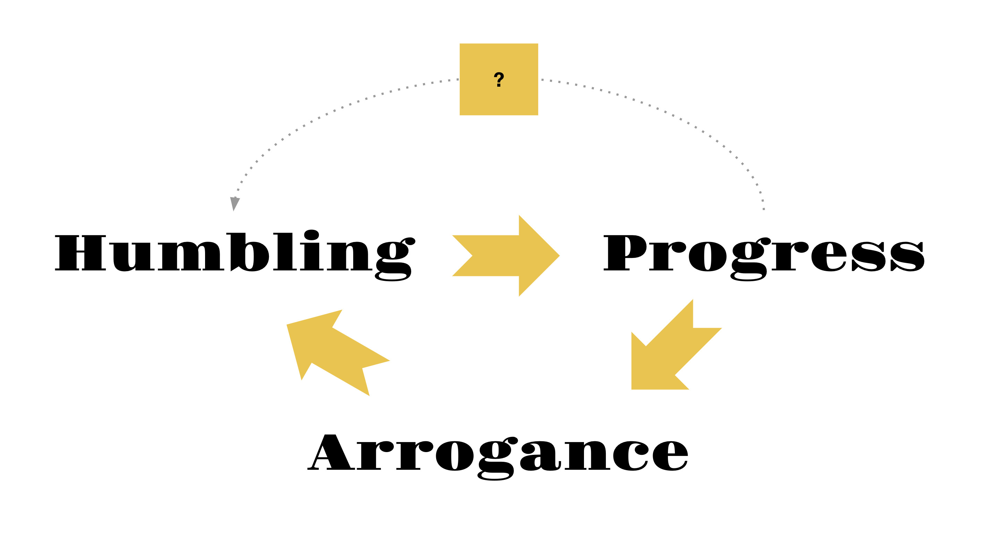

##### _Is falling on our faces the only way of moving forward?_

---

1543 was a year of a great humbling. Copernicus published his "De revolutionibus orbium coelestium" (On the Revolutions of the Celestial Spheres) in which he proposed a heliocentric model and thus - with a stroke of a pen - radically demoted us humans from the chosen beings at the center of creation, to insignificant occupants of a third rate planet.

Of course, at first this great humbling didn't register. Great humblings are always hard to comprehend and even harder to swallow. So they tend to take a while to trickle down. But eventually it did. Luckily for Copernicus he was long dead by then (he died the same year he published his work). But almost a century later (in 1633) Galilei, a public supporter and promoter of the heliocentric model, was tried by the inquisition and had to live the rest of his life under house arrest. It took at least another century for the heliocentric model to become widely accepted. We came to terms with the demotion. And in a way it was liberating. We were not in the center. We were not all there was and all that mattered. We were free to play and explore from the periphery.

The next great humbling came in 1859, when Darwin published "On the Origin of Species" and thus radically demoted us humans from the pinnacle of creation, made by an omniscient God in His image... to merely a side branch on the tree of life, created accidentally by the blind evolution. More than 150 years later we are still not fully done internalizing and coming to terms with this demotion.

Today, in mid 2020s we are living through a yet another "Great Humbling" shock. This time we are being demoted from "the only form of advanced intelligence on the planet and possibly in the universe" to "merely one kind of brain capable of complex symbolic reasoning". We are still in denial. Trying to cling on to our unique "license to think". Trying to convince ourselves that the "stochastic parrot" that is more convincing than an average human is still a zombie and is not "really" capable of reasoning.

But eventually it will all sink in. And just like before, it will be liberating. It will lead to progress. Because once we are not the only species carrying the torch of intelligence in the dark and mindless universe, but merely one of many possible forms of intelligence out there - then you are free to explore, to play, to find and create new things.

{.gs-img-border}

 

I like to think that taking ourselves a little less seriously is a pre-requisite for progress. It goes somewhat like this: Great Arrogance leads to a Great Humbling. Then a Great Humbling leads to a moment of Great Progress. Finally, the fruits of Great Progress lead to the next Great Arrogance and the cycle continues.

It seems that this is true not only for us as a species, but also for us as nations, as communities, as individuals. Before 1905 the Natural Sciences community shared in the great arrogance, talking about how the majority of the world was finally understood, once and for all. Lord Kelvin is often quoted as having said in a lecture in 1900 that "there is nothing new to be discovered in physics now. All that remains is more and more precise measurement." That was a precursor for the great humbling that surely followed, spearheaded by Einstein. And that great humbling in turn led to great scientific and technological progress that unfolded throughout the 20th century.

Children early on in their development assume that they are the center of the world, and the only thinking being. But by the time they are 3-6 years old, they acquire the "theory of mind" and realize that they are one of the many conscious actors, and others have distinct thoughts, feelings, memories and ideas. Normally, as we get older and more mature, the humbling continues (some people only get more arrogant with age, but let's treat this here as an excpetion that leads to stagnation in personal development).

Nations also go through the phases of Great Arrogance, ineviatbly followed by a Great Humbling (unfortunately normally achieved only through a lot of bloodshed). And if the Great Humbling was successful, then a period of Great Progress tends to follow (e.g. Japan  & Germany after WWII).

Going back to the world today, we seem to be on the brink of a few great humblings at the same time. Our great arrogance as the only intelligent species is being humbled by AI & Robotics, as well as latest reseach in computational biology. Our great arrogance as the rulers of the earth is being humbled by climate events and pandemics at the scale that we can't control. And our great arrogance as the "United West" unilaterally telling the rest of the world how everyone should live is being humbled by the rebalancing of world economies and,
consequently, powers (particularly China, Middle East and India).

I have little doubt that in the long run this mega-humbling event on our current horizon will lead to progress. But the question is: could we get humbled without a big war (with each other and/or with the machines)? And then - could we stay humbled for longer? Could we decide to always take ourselves a little less seriously? Could we feel perpetually free and playful on the periphery, rather than "focused, critical and all-important" at the center?

Just imagine a kind of progress we could unlock if learned to simply stay humbled - as individuals, as nations and as a species.

 
