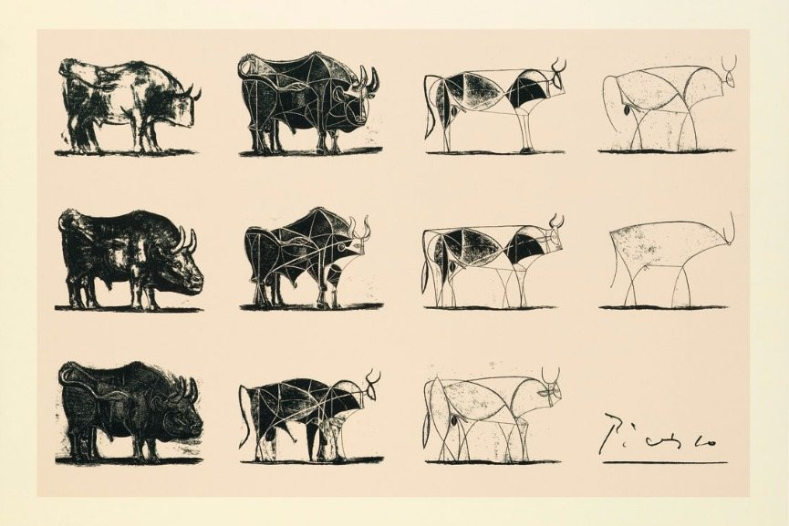

## Part 1 (poetic): The soil and the sword

How Does a Powerful Line Emerge?

As writers of words, music, or code, we are constantly confronted with this atomic challenge of our craft: getting to a single good line. Not just a single word or a note—that in itself is still devoid of power, surprise, or relationship. But a line, a connected set of dots and spaces in between, a phrase. Once you have a good line, the rest can feel easier. You just need the next one. And you need to know when to stop, which is a whole art in itself. But the big question remains: how does a single good line come about?

The ultimate path of divine inspiration aside, I'd like to propose that there are two primary approaches to this challenge. Let us call them sculpting and gardening.

Gardening is the way of the soil. It's additive. It can be indecisive. You unblock and create conditions for variety. You remove the censors and allow dozens, hundreds of possibilities to grow onto the page (or at least onto your mental scratchpad). The weak ones die out. You evolve the stronger ones until they bear fruit. And at some point, when the stars align - or when you run out of patience — the best option becomes the one. The ultimate garden is a jungle: the "stream of consciousness" style of writing where the natural flow is unimpeded and curation is minimal.

{style="width: 100%;"}

Sculpting, on the other hand, is the way of the sword. It's subtractive. It's fateful. You take a block of raw material in which there is a latent possibility, and you cut out everything that is not essential. Ruthlessly. Decisively. You strip it to the bone. And you tremble as you do it, because there is no gluing anything back. The ultimate example of sculpting technique in a linguistic medium is blackout poetry, where the newspaper page is your block of marble and the black marker is your unforgiving chisel.   

Sculpting and gardening feel very different. But there is a lot of underlying similarity. Both require you to trust the medium. In the case of gardening, you need to trust that the soil is ultimately capable of growing what you are longing for. In the case of sculpting, you need to trust that the block of stone contains the right kind of possibility in it.

Both methods put the primary responsibility on perception, not on creation. In gardening — as a multitude of variations emerge — your real job (beyond waiting, watering, seeding, fertilizing) is to see the promising specimens and select them. Famously, Brian Eno talks about how his way of composing is significantly about selection; he can be seen as a "selectionist" composer, listening to hours of semi-random combinations of possibilities generated by systems he creates, and then picking the compelling ones.

In sculpting, it's also all about perception, not creation. Except what you are looking for is not the best pieces, but the unnecessary ones. Which parts can be removed? Which words are irrelevant to the heart of the matter? Picasso and his bull plates come to mind as the epitome of sculpting. Similarly, consider Thelonious Monk and his punctuated, sparse, almost disappearing melodies that hit hard precisely because all the embellishments are removed to the point where the structure barely holds together.

Sculpting and gardening are methods, not religions. If one doesn't work, you try another. You alternate. I would even argue that for the majority of creative projects, you need to use both. Write drunk, edit sober. Treat your medium as a highly agentic, unstoppable generator of possibilities. Then, as an inert stone that imprisons your creation. Breathe in, breathe out. Just don't do both at the same time.

## Part 2 (practical): Testing the Theory

Now that the dichotomy is established, let us shift to a less poetic gear and think about how we could test this dualistic "sculpting-gardening" theory of creativity in practice. The central prediction our theory makes is that people who practice both sculpting and gardening will, on average, arrive at better output than people who only use one of these methods.

To test this prediction, we would ideally need a large rooms full of identical twin poets, divided into four groups:

1. The purist gardeners
2. The purist sculptors
3. The balanced sculptor-gardeners who practice both approaches equally
4. A control group who don't practice either specific method intentionally

After a year of study, we would bring the poets together and ask them all to write a poem in a day. We would then need to get them to self-rate the poems and how they felt writing them. We should also get the poems rated by independent judges. If, at the end of all this torture, the balanced sculptor-gardeners reliably create better work and feel good about this work themselves, then we would have evidence to support our theory.

Sadly, I don't have a room full of identical twin poets on whom I can run experiments. So, we can turn our attention to something more accessible: Large Language Models (LLMs) that, despite all their glories, are still mostly terrible at creative writing. Let us examine how LLMs write.

At its core, the next token prediction logic is very close to gardening, except the unit is a token, not a line. At each next token, the inner layers of the network generate options for what that token could be, and the last layer exposes each with its perceived probability. At the very end of the process, the algorithm selects one of the "best" possible alternatives (one of which is to stop by selecting the stop token as the next one). This selection normally happens using a mechanical approach (i.e., parameters like temperature, top_k, top_p).

So we can say that, at least at the level of tokens, the gardening method is somewhat there—multiple alternatives are explored, and then one is picked.

But what about sculpting? Sculpting seems nowhere to be found. Even reasoning LLMs that can sometimes change their "mind" mid-thought and omit outputting certain parts of their internal processing as the final answer still don't do proper sculpting, in the sense of refining a larger generated block by strategic removal, at any point in the process.

Could the lack of sculpting be a reason why LLMs can be perceived as less than stellar at creative writing? Could we add sculpting to their creative metabolism? In some sense, diffusion algorithms (often used in image generation) are closer to sculpting. They typically start with a randomized block (like noise) and then gradually adjust it to look more like what we are after, iteratively refining the image. But still, this is not exactly the same as targeted, subtractive chiseling of an existing, over-complete form.   

So let us speculate on how proper sculptor networks could be created for text. Our minimal goal is to train a network that will perform blackout poetry well. We will give it a piece of text, and it will cross out words and letters to create a subtext out of it, and this subtext should have creative power.

What we need first is obviously training data. Luckily, we can create plenty of it by taking powerful pieces of poetry from the public domain and "expanding" them using conventional LLMs, which are great at this kind of elaboration.

For example, we can take Hokusai's famous haiku:

> Though on the sign
> 
> it says "Mount Fuji this way" —
> 
> We see only mist

Then we can ask a conventional LLM to fill in the words around this core, and it might end up with something like this (illustrative example):

> The museum staff had been working late to finish the new exhibit. **Though** exhausted, they pressed on, determined to complete the installation. A visitor's sign-in sheet lay forgotten **on the sign**-in desk. **It** clearly **says** in bold letters "**Mount Fuji** Photography Exhibition **This Way**," with an arrow pointing to the east wing. But when **we** arrived that morning to **see** the display, **only** empty walls and **mist** from the humidifiers greeted us—the photographs were still in their crates.

Now we have ourselves a training pair: the expanded text as input, and the original haiku as the desired "sculpted" output. What's great about this method is that for the same target poem, we can produce an unlimited number of source texts - different in length, style and subject.

Extrapolate this lot, and we have a training set. A training set for artistic attention — for finding the special in the mundane, for chiseling away the obvious to reveal the beauty hidden inside it.

The rest is technical: training, scaling, tweaking, regularising and injecting noise to avoid overfitting the data — the usual machine learning procedures⁶.

One interesting question is whether to supply an instruction together with the source text (e.g., we could supply the source text + instruction like "write a haiku about Mount Fuji and mist" as input). Or, only the input — effectively training the network to find the subject itself, but relinquishing control over what the network will give us back. Probably both should be tried, but my intuition currently is that the latter (no instruction) is going to be more interesting.

Another interesting question is whether we should supply, as part of the input, the target number of words to be left, or perhaps the target percentage of the input reduction. We can then use our synthetic data generation process described above to generate source examples that are "watered down" to various degrees.

Lots of interesting parameters and details to play with. But that's for another day.

For now, let us just imagine for a second that this whole process works, and we have an expert sculptor network — the blackout poet laureate made of silicon. What would we do with it next?

It would probably be interesting and useful by itself as an artistic or editorial aid. But we could also consider adding it as a step in the traditional LLM stack. Imagine that a future creative agent does some "gardening" generation with high temperature first — effectively producing a rich stream of possibilities—but then, at the end of each line or phrase, the sculptor mini-network is engaged to cut things up and chisel it to the aesthetic core it had possibly hidden inside.

This may seem similar to what reasoning models do, but it's not really the same thing as the post-thought process is not that of adding, but that of taking away.
Also the idea is to do this at the level of each line or phrase, not the full response. Or maybe the technique of alternating gardening and sculpting can be applied at a variety of levels: from short phrases to full texts. In any case, this loop should go line by line. Seeding and growing the options, then chiseling the good one(s) into their essence. And then the loop continues to the next line.

Hopefully, a powerful one.