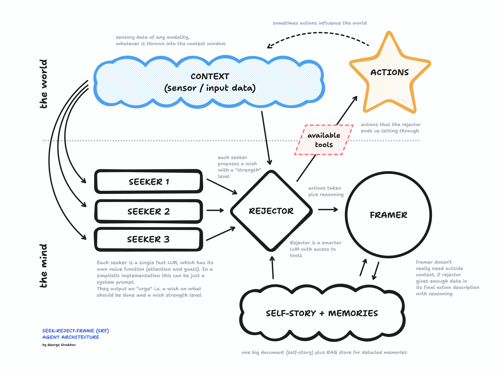

###### _a proposed architecture for Freudian Agents_

- - -

## Current agentic patterns: the assembly line, the org chart, the parliament

Most agentic approaches and frameworks today are following the same basic pattern:

- Give LLM some goals and some tools.
- Allow it to run a few loops - using tools to achieve the goal and evaluate the results.
- Return the final result to the user when the goal is reached.

One can then string these basic "building block" agents together into a more powerful meta-agent or agent team. For this there are a few patterns (as, for example, implemented in [crew.ai](https://docs.crewai.com/concepts/processes)):

- **Sequential pattern**: no magic here, just a simple programmatic flow. This is like agents working on a pre-defined assembly line. 

- **Hierarchical pattern**: one manager agent, effectively using other agents as tools. So, the same pattern as a single agent, just scaled up (potentially this can fractally scale up indefinitely, like a hierarchical organisation as it grows)

- **Democratic pattern**: various agents working together have to reach some sort of consensus for the system to give the final output. This is the least clear pattern and I'm yet to see any practical implementation of it, but in theory it sounds interesting and possible.

All of the above makes intuitive sense because this is our usual way of thinking about _human_ collaboration in organisational and societal settings: the assembly line, the org chart, the parliament.

## New brain-inspired approach: Seek - Reject - Frame

I would like to suggest a possibility for an alternative approach: what if instead of taking inspiration from the inter-human organisational patterns, we look into the intrinsic organisation of a single human being? What if we try to assume that LLM mini-agents are not "worker" building blocks for an organisation, but rather parts of a [society of mind](https://en.wikipedia.org/wiki/Society_of_Mind)?

The latest research in neuropsychology [suggests](https://www.google.com/search?q=the+hidden+spring+mark+solms) that the brain is not organised in a top-down way and neither is it democratic. Most importantly, the overall drive / goal of the system does not seem to be coming from the top at all. It's coming from the bottom. Here is a brutally simplified idea:

### 1. Seek

At the bottom we have a SEEKER. A relatively simple, evolutionary archaic agent with an innate drive that it wants to satisfy all costs. It has access to the sensory input and intuitively / quickly makes deliberations about what should be done to further its goal, i.e. it produces a desire or a **wish**. The kinds of goals that a SEEKER can pursue are very simplistic and relatively short-term. A seeker knows what's good for it and is always looking to get it.

> Hungry? Let's go find some food. Yum yum!

This kind of thing. The time horizon is short. There is very little planning involved. And the value function that the SEEKER is optimizing for is usually as simplistic as that of a thermostat i.e. check if you are in an optimal zone and if not - do whatever it takes to get back to it.

### 2. Reject

At the top - we have a REJECTOR. The job of the higher brain is not to generate desires and goals. It's to tame them, to prevent them from ruining your life. The drives are coming from a bunch of SEEKERs below, but those SEEKERs themselves are too simplistic to be trusted fully to run such a complex organism:

> Yes there is tasty food on the table next to you in the restaurant. And you have an urge to grab it. But it's probably not wise to do so as the people next to you won't be amused and you would end up in a fight or a police station. And your date won't like that. So thank you very much SEEKER, but no thank you. Not right now. Wait.

The REJECTOR's job is to say no. To look at all the things that the SEEKER (or in reality a few SEEKERS, each with different goals / drives) wants to do and to reject 99% of them 99% of the time. Occasionally some wish (proposed action) looks decent enough to go for it. Or maybe one of the SEEKERs gets such a strong desire that REJECTOR just can't do anything about it and has to let it through (as long as there are tools available to action on it).

> SEEKER: We are starving. Let's grab this right now.

> REJECTOR: Oh, no, but we will annoy others.

> SEEKER: We will DIE if we don't. Shut up and tell that hand to grub the yum yum RIGHT NOW.

> REJECTOR: Ok, fine. We will make up a story for why it was a proper thing to do later.

How does the grand filter of the REJECTOR operate? Here is a possible model:

- First, the REJECTOR collects all the proposed wishes from the SEEKERs. For each wish there is an associated strength (which can be used as a weight or for a gate function of some sort).

- Then, the REJECTOR tries to understand whether there is a concrete action that can be taken to fulfill this wish and then does some imaginary time-travel to predict the consequences of each proposed action on different time horizons. This is the superpower of the higher brain: doing time-travel and running multiple simulations of the future, to understand whether the SEEKER's wishes could be realized and whether going for it makes any sense in the longer run. What does "making sense" mean here? I'm not too sure how to best formalize this. But a good first guess is to simplify the judgement to the following three factors:
    - **safety** (self-preservation drive)
    - **satisfaction** of the same drives of the SEEKERs but in the future.
    - **self-story** consistency i.e. are we continuing what we have always been about? More on this below.

- Finally, after doing the future simulations and calculating the overall value function (safety + satisfaction score in the future + story consistency) - the REJECTOR decides which SEEKER's wish (if any) should be fulfilled right now and what action it can be best fulfilled with. And then the action is taken.

### 3. Frame

The last, but critically important step is to post-rationalize the story of why we did what we did and why it made sense. This is done by the FRAMER _after_ the choice is made. The job of the FRAMER is to invent a plausible story about why the collective intelligence of SEEKERS + REJECTOR is doing what they are doing. Self-story-making here is critical for the future operation of the REJECTOR. 

SEEKERs don't much care about the past or the distant future. They are just optimising for the perfect state in the here and now. But the REJECTOR needs access to long-term memories and stories so that it can project into the future better. And so it's the FRAMER's job to continuously form (and deform) memories in a way that would imply a consistent, coherent self: a story that can be continued and against which the possible future actions can be evaluated. If the REJECTOR is concerned with physical self-preservation, then the FRAMER is concerned with conceptual self-preservation.

As Mark Solms likes to put it: memories are _of_ the past, but they are _for_ the future. Past memories can easily be altered and molded to fit the needs for a coherent self-story, because without a coherent self-story a REJECTOR would not have enough basis for a reasonable choice: a choice that would have a chance to truly optimize the overall chances of success of the collective intelligence in the long run.

## SRF in practice

Let us now imagine how SEEK-REJECT-FRAME (SRF) pattern could be implemented in practice, using LLMs as building blocks. Here is a conceptual diagram:

- An SRF agent runs in a continuous loop that never stops as long as the agent is alive and not hybernated.

- At the start of the loop we programmatically check for new inputs i.e. is there anything in the context?

- The context data (if not empty) is passed to each of the SEEKER agents as a new message in the message stack. If no new data - then the old message stack from the previous iteration is passed again. Each SEEKER is an LLM with a specific system prompt that defines its target state and what it's meant to do if the target state is not matching the context. We don't need a very smart model. Something fast and straightforward will do.

- SEEKERs don't really have proper long-term memory. But there is a buffer of some number of "messages" that we can keep in the short-term memory stack of the SEEKER.

- After evaluating the context against the goal (target state), each SEEKER outputs an "urge" in the form of a structured response with 2 things in it: "wish" and "strength" (0-10 scale).

- As the next step of the loop, the REJECTOR kicks into action. It takes multiple inputs:
    - urges from all the SEEKERs whose wishes have a strength above 1.
    - outside context info (the same information that was passed to the SEEKERs)
    - available tools / possible actions that can be taken
    - previous self-story and relevant memories (RAG from context + wishes)

- Based on all of the above the REJECTOR makes a deliberation. The system prompt specifies that it needs to decide to take an action and which action (or refrain from acting explicitly. The choices should be made by projecting possible consequences of fulfilling "urges" into the future and evaluating the results by safety, future satisfaction of urges and self-story-consistency). Rejector is where we need a really smart LLM, I think latest reasoning models will do well here.

- The REJECTOR may decide to do nothing. That's as important a decision as any other and is processed in the similar way described below.

- When the REJECTOR has finished deliberating - it outputs the action to be taken and the reasoning behind this action. The reasoning should be long and detailed, including relevant context details i.e. which parts of situation it decided to pay attention to when it deliberated, as well as wishes that were present, but suppressed or followed through and why.

- If there is an action to be taken - it can be taken via available tools given to the REJECTOR. And the results of that action (if any) should be added to the context for the next iteration of the SRF agent loop.

- Both the action (or non-action) and the reasoning behind it are then passed to the FRAMER for the last "post-rationalization and memory formation" step of the loop.

- The FRAMER is activated _after_ the action is taken (or at least after the signal to do the action is sent) so as not to slow down the process. The FRAMER takes in the action, the reasoning and previous self-story. It then proceeds to rewrite/update the self-story to frame the action (or non-action) as a coherent continuation of the self. It also decides what new individual memories to add to the memory store and does so (write a snippet, calculate embeddings, add to the vector store). The FRAMER, like the REJECTOR needs to be driven by a strong LLM with a large context window, and ability to conceptualize and post-rationalize.

- It's important that actions-not-taken are equally contributing to the self-story and memories because suppressed wishes are an important aspect of personality (hello, Freud!). From a pragmatic standpoint, actions not taken are really important learning moments. One of the reasons humans are so much "smarter" than other animals is that our ability to **"learn by not doing"** is very strong. We can imagine in our heads the consequences and we can learn from those imaginary tries over time. Without actually suffering the consequences in the real world.

- This concludes a single loop of our SRF agent existence. And we are off onto the next iteration. Where the results of actions taken, as well as new user messages or sensor readings may be present in the context. And the merry go round starts again.

As an interesting side benefit, the SRF design allows an agent to "dream". In a dream - the agent doesn't actually take the actions in the real world. So the urges coming from the SEEKERs don't need to be suppressed as much. Dreaming is a state where the REJECTOR's suppression function is significantly diminished and it doesn't have any tools to do actions in the real world. Instead of taking action - it just short-cuts its projections of the imaginary actions into the imaginary context. And the loop keeps going (including the FRAMER!) - so learning is happening, all be it in a different way (possibly a different threshold for memory formation is applied).

## Are Freudian Agents practical? Are they conscious?

So we have successfully imagined a new kind of SRF (SEEK-REJECT-FRAME) system, which we can call a Freudian Agent, since it starts with the "subconscious" wishes and then suppresses them later.

A couple of important questions arise:

- Can such agents be built?
- Would they be practical and valuable?
- Would they be conscious?

I don't have the answers. But my intuition is that they **can** indeed be built (nothing in the diagram above looks impossible and I may even try to make a simple proof of concept in the coming months).

I also do believe that there will be practical uses for such agents. You don't need them for simple things. But in complex, long-running, highly ambiguous environments where today's simple hierarchical agents fail miserably - Freudian agents could show more resilience and ultimately more intelligent goal-directed behavior. However designing and training a good Freudian agent will be
a tricky art:

> What baseline desires (for SEEKERs) do you need in order to have the final agent behave in a way that you want it to behave?

> How cautious and strict should the REJECTOR be? Is the cautiousness (i.e. wish-to-action threshold) a fixed meta-parameter or something that dynamically changes depending on the context and the state of the system as a whole?

> What initial self-story (if any) would you want to implant into the FRAMER's memory?

Last but not least, on the matter of consciousness: like [Michael Levin](https://www.youtube.com/watch?v=7FJfdO53Q-w), I reject the idea of consciousness as a binary kind of quality. It seems to me that there is no hard boundary. It's a spectrum: from the simplest stone, to the human being and beyond. And so the question "Are they conscious?" is somewhat meaningless.

The real question is: could Freudian Agents be _more_ conscious than the simple ReACT ones we have today? My intuition is that they could.

But we will have to build them to find out.
