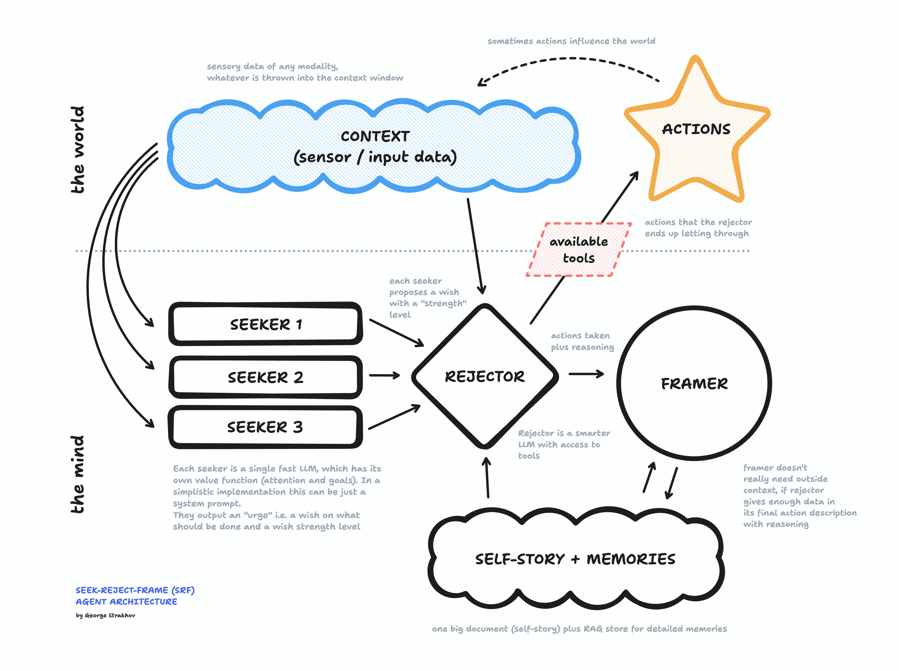

Current AI agent architectures follow familiar organizational patterns: assembly lines, hierarchies, and democratic systems. But what if we took inspiration from the human mind instead? Recent neuropsychology suggests a different approach – one where goals and drives emerge from the bottom up rather than top down.

Enter the Seek-Reject-Frame (SRF) architecture, a new paradigm for building more sophisticated AI agents. At its core are three key components working in continuous harmony.

The SEEKER operates at the foundation – a simple agent with basic drives and immediate desires. Think of it as your gut instinct, always scanning for what it wants and needs. "Hungry? Let's find food!" It's not complex, but it's persistent and clear about its goals.

Above the SEEKER sits the REJECTOR, whose job isn't to generate desires but to filter them. While the SEEKER might want to grab food off someone else's plate in a restaurant, the REJECTOR steps in: "That would cause problems. Better wait." The REJECTOR evaluates potential actions through three lenses: safety, future satisfaction, and consistency with the agent's ongoing narrative.

Finally, there's the FRAMER, which makes sense of it all after the fact. It's the storyteller, weaving a coherent narrative about why the agent did what it did. This isn't just post-rationalization – it's crucial for future decision-making. The stories we tell about our past actions shape our future choices.

In practice, an SRF agent runs in a continuous loop. Multiple SEEKERs generate wishes with different strength levels. The REJECTOR evaluates these against context and possible actions, making decisions based on projected outcomes. The FRAMER then updates the agent's self-story and memory, incorporating both actions taken and those deliberately avoided.

This architecture even allows for "dreaming" – states where the REJECTOR's suppression is lowered and the agent can safely explore scenarios without real-world consequences. This could be vital for learning and development.

But can such Freudian agents actually be built? And would they be practical? The technical components all seem feasible, though implementation would be complex. They might prove especially valuable in ambiguous, long-running scenarios where current hierarchical agents struggle.

The bigger question might be consciousness. Rather than asking whether these agents would be conscious (a binary that may not exist), we should ask whether they could be more conscious than current AI systems. By incorporating internal conflict, memory, and narrative – key aspects of human consciousness – they might indeed achieve higher levels of awareness and autonomy.

Key challenges remain: What basic desires should SEEKERs have? How strict should the REJECTOR be? What initial self-narrative should we provide? These aren't just technical questions but philosophical ones about the nature of agency and consciousness.

The SRF architecture represents a radical departure from current AI agent designs. By mimicking the dynamic interplay between instinct, restraint, and narrative that characterizes human consciousness, it might offer a path toward more sophisticated artificial minds. Whether this leads to truly conscious machines remains to be seen, but it could certainly lead to more capable and interesting ones.

Building these agents won't be easy, but the potential benefits – both practical and theoretical – make it worth exploring. As we continue to develop AI systems that can think and act more like humans, understanding and implementing these psychological architectures becomes increasingly important.