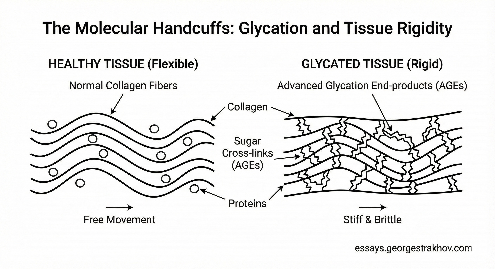
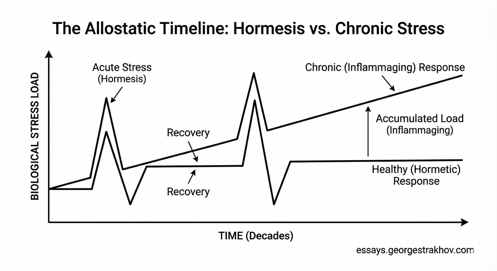
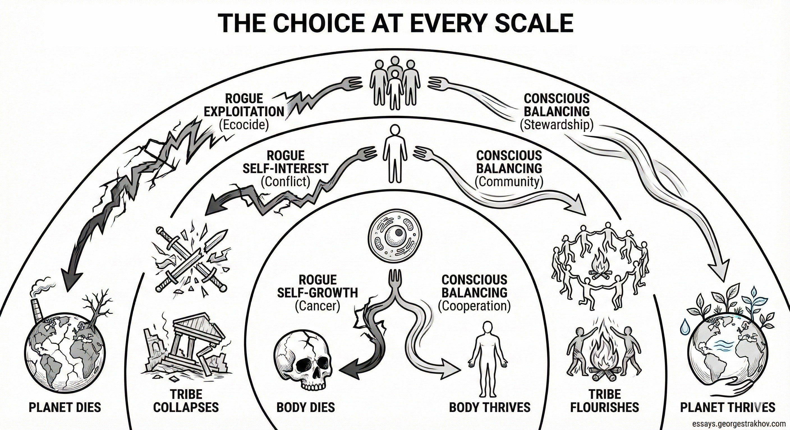

### _An Etiological Framework of Biological and Cognitive Aging_

> "How did you go bankrupt?"
>
> "Two ways. Gradually, then suddenly."
>
> *— Ernest Hemingway, The Sun Also Rises*

I have been thinking about death recently. Not the kind that finally takes us offline, but the other kind. The slow kind. The kind that many people experience for decades while still being technically alive.

As I approach 40, I have started to feel the initial tremors of that specific decay. It prompted me to do some research. I wanted to understand this slow living death - its mechanism, its inevitability, and what I can do to ensure that when I finally wrestle with her, it is at least a fair match.

The current landscape of longevity medicine - often called "Medicine 3.0" - correctly identifies the primary drivers of mortality as the "Four Horsemen": heart disease, cancer, neurodegeneration, and metabolic dysfunction. This is correct as far as it goes. These are the names written on death certificates. But they are outcomes, not causes. They are lagging indicators. By the time the diagnosis arrives, the underlying processes have been running for decades.

To understand what makes people old - not just what kills them - we need to look upstream. We need to see the riders before they arrive.

## The Four Horsemen

It seems to me that the primary agents of decay are not diseases, but Mother Nature's normal forces, taken out of context and out of proportion. They are the mechanisms of conservation that, once they have done their thing, have the potential to dissolve the order of a living system. I call them **The Real Four Horsemen**: **Sugar**, **Stress**, **Solitude**, and **Stiffness**.

These are the riders. They don't work alone - they ride together, reinforcing each other, until they converge into a single overwhelming force: systemic inflammation. And inflammation is the road that leads to most of the diseases that finally kill us.

We can think of each of these Horsemen operating on two fronts: **Body** and **Mind**. And I don't mean this as a metaphor - we're integrated systems. The forces that stiffen arteries stiffen thinking. The forces that fragment attention fragment tissue. Modern life attacks us on both fronts at once.

Here's how the entropy takes hold.

## 1. Sugar: The Agent of Acceleration

### The Body: Caramelization

Sugar is a chaotic, sticky molecule. Flood the system with excess glucose and it triggers **glycation** - a reaction where sugar bonds to proteins and fats without enzymatic supervision. The resulting compounds are called Advanced Glycation End-products. AGEs.

The acronym is perfect. AGEs literally caramelize us from the inside. They form irreversible cross-links between collagen fibers, turning flexible skin and arteries into rigid, brittle structures. Think of healthy tissue as combed hair, and glycated tissue as a tangled, matted knot that no amount of conditioner will fix.

The damage isn't only structural. AGEs bind to a receptor called RAGE (Receptor for Advanced Glycation End-products), triggering a cascade of chronic inflammation. Which feeds the Stress Horseman. The Horsemen always work together.

This acceleration is now quantifiable. A 2024 study using the GrimAge epigenetic clock found that reducing added sugar intake was associated with a biological age reduction of about 2.4 months[^1]. Excess sugar isn't just fast calories and a path to diabetes. It's an instruction to the genome: we've got too much energy over here, so *age faster*.

### The Mind: Dopamine Dysregulation

There's a mental equivalent. Refined sugar gives a caloric spike with low nutritional density. Short-form algorithmic content gives a dopamine spike with low epistemic density. TikTok is the high-fructose corn syrup of information.

Both create tolerance. The "swipe" is a variable reward schedule - a slot machine in the pocket. Chronic use downregulates dopamine D2 receptors. This is insulin resistance of the mind. Once the baseline shifts, activities with slower payoffs - books, deep conversation, complex problems - feel chemically unrewarding. Not boring. *Aversive*.

The damage shows up on scans. Active use of short-form video platforms degrades the brain's "Alerting Network" - the system responsible for maintaining readiness to respond[^2]. Use it or lose it. We're losing it.

Now, before we throw out all the bread: the brain burns 20% of metabolic energy. We need fuel. The same goes for novelty - it drives curiosity and learning. The Horseman is not the substance. It's the *dose* and the *velocity*. When fuel arrives faster than the machinery can process it, and when fuel never runs out, things break. This is true for cells drowning in glucose. It's true for minds drowning in content. We've evolved for scarcity of fast fuel and bright, interesting patterns. We've evolved to feast _and_ fast. If we are only feasting - we die.

A good example of how the feast-fast approach is something that we evolved for are ketones. When glucose is plentiful - insulin helps store it into fat. So that when glucose is scarce the liver can turn fat back into ketone bodies, and the brain and muscles can burn them instead. Some researchers think this metabolic flexibility - the ability to switch fuel sources - is itself protective. Fasting, low-carb diets, and endurance exercise all trigger ketosis. It's like cross-training for the mitochondria. The body that can only run on sugar is brittle. The body that can switch fuels is resilient. Same goes for a mind that can only be stimulated by fast content versus one that can still find a book interesting.

## 2. Stress: The Agent of Erosion

### The Body: Inflammaging

Stress used to be temporary. A lion appears, cortisol spikes, we run or fight, and then it's over. The system resets. The Horseman is what happens when the system never resets. When the stress becomes chronic, unrecovered. This manifests as **Inflammaging** - a sterile, low-grade, systemic fire that burns without infection.

Under chronic stress, the HPA axis (hypothalamic-pituitary-adrenal - the body's stress thermostat) breaks. We develop glucocorticoid resistance. Immune cells stop listening to cortisol's "stand down" signal and pump out inflammatory cytokines around the clock. Meanwhile, stressed mitochondria start leaking. They release debris (DAMPs - Damage-Associated Molecular Patterns) that the body mistakes for bacterial invasion. The immune system attacks a threat that isn't there. The threat is us.

But this damage isn't permanent - *if* we recover. A 2023 study found that biological age is fluid. It spikes during severe stress and fully restores upon recovery[^3]. The Horseman isn't stress itself. It's the missing recovery signal. Never getting the "all clear."

### The Mind: Decision Fatigue

The prefrontal cortex is expensive to run. Under the crushing load of modern life - too many choices, too many notifications, too many open loops - it depletes. This is "technostress," and it's different from being chased by a lion. The lion eventually goes away. The inbox never does.

When the PFC depletes, glutamate accumulates, and the brain starts shutting down high-cost processing. Control shifts from the "Rational Planner" (prefrontal cortex) to the "Impulsive Toddler" (amygdala). The result is a tilt toward anxiety and away from long-term thinking. We lose the ability to simulate the future. We get trapped in a reactive present, bouncing from stimulus to stimulus.

Complete lack of stress is also deadly. We need **hormesis** - acute, intentional stress. Exercise. Cold exposure. Fasting. Heat. These trigger the Nrf2 pathway, which upregulates antioxidant defenses and cellular repair. The poison becomes medicine when we control the dose and - crucially - when we stop. A sprint followed by rest makes us stronger. A marathon we're never allowed to finish grinds us to dust.

## 3. Solitude: The Agent of Vulnerability

### The Body: Threat Vigilance

Social isolation increases all-cause mortality by 32% - comparable to smoking 15 cigarettes a day, worse than obesity or physical inactivity[^4]. Loneliness kills faster than cheeseburgers.

Why? Lots of underlying causes and variables are hard to isolate. But the most interesting causal link I've stumbled upon so far is the **Social Baseline Theory**: we evolved as obligate social animals. Our brains expect to share the metabolic load of survival - vigilance, resource gathering, defense - with a tribe. When we're alone, the brain perceives a resource deficit and a threat surplus. It starts revving the engine, preparing for attack.

This triggers what researchers call the CTRA profile (Conserved Transcriptional Response to Adversity). The lonely body upregulates genes for inflammation (preparing to fight wounds from predators) and downregulates antiviral defense (less important when about to be eaten). We're biologically preparing for a war that isn't coming, burning through cardiovascular reserves in the process.

### The Mind: Epistemic Isolation

The mental version of solitude is the echo chamber. The brain is a prediction engine that learns through error correction. Real social interaction forces this: decoding micro-expressions, navigating disagreement, inhibiting impulses, modeling other minds. Hard work. This friction is what maintains the machinery.

But if we retreat into algorithmic validation, into echo chambers, into AI-only conversations that create an endless "yes you are so right" feeling - then we stop encountering "error." The neural circuits for perspective-taking and complex reasoning atrophy from disuse. Shrinking the world to a monoculture is the mental equivalent of staying in bed for a decade. The social muscles waste away.

There's a difference between being alone and being lonely. **Isolation** is the Horseman - the ultimately unwanted, chronic disconnection that biology reads as a survival threat. **Deliberate Solitude** is something else entirely. The brain needs time alone to run its "Default Mode Network" - the processing required for creativity, self-reflection, and making sense of experience. Monks seek it. Artists require it. The danger is losing the bridge back. Solitude chosen is restorative, and is punctuated by intentional encounters with the new and the other. But pure isolation is corrosive.

## 4. Stiffness: The Agent of Rigidity

### The Body: The Fibrotic Cage

Stiffness is the terminal Horseman. It's what happens when the damage becomes permanent.

This plays out in the Extracellular Matrix (ECM) - the scaffolding between cells. At both the structure and the signaling environment levels. When the ECM stiffens (from Sugar's glycation, Stress's inflammation), it undergoes changes that silence stem cells. Muscle stem cells can't regenerate in a stiff environment - they turn into fat or scar tissue instead. This is sarcopenia: the age-related loss of muscle mass. The soil hardens, and the seeds can no longer grow.

A lot of this stiffness isn't even "wear and tear." It's a neurological brake. The nervous system senses weakness or instability and tightens muscles to limit range of motion - a protective mechanism. Safety feature gone haywire. To reverse it, stretching the tissue isn't enough. We have to convince the nervous system it's safe to move. This is why loaded stretching and strength training work better than passive flexibility work. It's not just lengthening muscle - it's updating a threat model.

### The Mind: Cognitive Rigidity

The psychological version is loss of Openness, which is one of the most robust predictors of longevity. Open people live longer[^5].

Why? Openness drives (and is driven by) neuroplasticity. Open people learn new skills, new languages, seek unfamiliar patterns, build new synaptic roads, change their minds. Closed people run on cached heuristics. As the brain ages, it naturally shifts from plasticity to stability - this is energy-efficient but dangerous. Without active effort to maintain flexibility, we ossify. The paths we don't walk get overgrown. And as the snow of time covers the small paths, only the big familiar autopilot-worthy roads remain open (until in advanced dementia even they get closed).

Of course (unless you are a newborn), total plasticity would be chaos. Amnesia. We need "muscle memory" - the intimate knowledge of the shapes that lets a pianist's hands find the chords without thinking. We need mental structures and patterns too: convictions, values, reliable models of how things work. The problem isn't structure. It's **ossification** - losing the capacity to bend when the wind changes, to update one's priors. A strong, healthy bone is rigid under normal load but flexes before it shatters. A brittle bone just snaps.

## 5. The Vicious Cycle

These Horsemen don't ride alone. They recruit each other.

Sugar stiffens us - literally. Glycation cross-links collagen, clogging arteries. Movement becomes harder. Pain increases. So we move less. When we move less, we see fewer people. Isolation sets in. Loneliness is stressful - the body starts running its threat-detection routines on high alert, burning through resources. Stress depletes willpower. Depleted willpower reaches for the easiest dopamine hit available. Which is sugar. And the wheel turns again, a little faster each time.

The same loop runs in the mind. Dopamine dysregulation (mental sugar) makes focused thought feel unrewarding. So we avoid hard cognitive work and retreat to passive scrolling (of what the algorithm thinks we will like) - epistemic isolation. The world shrinks. Fewer perspectives, less friction, less error-correction. Thinking stiffens into familiar grooves. Stiff thinking is anxious thinking - it can't model new situations well, so more things feel threatening. Anxiety is stressful. Stress sends us back to the dopamine slot machine.

The loop runs both ways, though. Each intervention point can trigger a virtuous cycle instead. Move more, and the body clears glucose better. Clearer blood sugar means better mood and more willpower. More willpower means tolerating harder conversations and richer relationships. Richer relationships reduce the stress signal. Less stress means less inflammation. Less inflammation means tissues stay supple longer. And on it goes.

## 6. Fighting Back

All four Horsemen started as adaptations. Sugar was rare energy worth storing for future famine. Stress was a survival signal. Solitude was a moment to reflect and form new connections and patterns. Stiffness was structural integrity and strength. The modern world took these survival mechanisms and cranked up the dose until they became poison.

So what can we do? Restore the original signal-to-noise ratio.

**Against Sugar**: I'm trying to create scarcity. Not deprivation - scarcity. Intermittent fasting. Time-restricted eating. Periods of ketosis. The body remembers it has a backup fuel system. For the mind: friction before the feed. Turned off notifications. Scheduled periods of deep work windows where fast content is simply unavailable. The slot machine is harder to reach.

**Against Stress**: The intervention isn't less stress - it's more high-quality stress, followed by recovery. The off-switch matters more than the on-switch. Sleep is non-negotiable (this is where most of the repair happens). But also: deliberate downregulation. Cold water plunges. Breathwork. Meditation. Time in nature. Anything that activates the parasympathetic system and signals that the tiger is gone.

**Against Solitude**: Modern life doesn't deliver spontaneous social contact the way a village did, so it has to be consciously put in. It will be different for everyone. For me the core of it - is the nuclear family: there is not too much talking in our house, but there is a lot of hugging. Then, there are my music retreats. And climbing gyms. But it could be anything that forces the brain to realise that it can share the load (likes and comments don't count).

**Against Stiffness**: Moving in ways that require adaptation. Novel movement patterns. New skills. New musical instruments. New languages. New ideas. Reading things I wouldn't normally read. Exploring new paths and places. Situations where old heuristics don't work and new ones have to be built. Mobility work. Plasticity. Perspectives.

The opposite of "old" isn't "young." The opposite of old is **alive**, changing, plastic, learning, rebalancing. To be alive is to be capable of change, connection, and repair. We don't stop the Horsemen by fighting them head-on. We slow them down by refusing to pour concrete on the road they ride on.

## 7. Who is Aging?

Ok, one more question, a final little mental stretch before we conclude: if we are systems made of smaller systems, and parts of larger systems, then **who exactly is doing the aging?**

Some theories suggest aging is itself an adaptation - a form of "Pathogen Control." Aging as a programmed immune system for the tribe, removing older individuals who might become reservoirs for chronic infection or occupy niches needed by the young[^6]. From this angle, my individual death is an act of life-preservation for the species. My cells die to keep me alive. I die to keep the tribe alive.

There is a beautiful cosmic picture here of a cycle of self-sacrifice on the path to cosmic renewal. A choice of multi-scale living, all the way down (and up). When a cell prioritizes its own growth and reproduction above all else - ignoring the signals from the body, refusing to die when it should - it becomes cancer. It kills the host, and then itself. The same pattern plays out at every scale. Individuals who exploit their tribe eventually destroy the community that sustains them - and then themselves. Species that consume their environment without balancing... well, we're running that experiment now.

The choice isn't between self and whole - that's a false binary. It's about conscious balancing. A healthy cell serves itself AND the body. A healthy individual serves themselves AND their community. The needs of each level and the levels above and below aren't in opposition. They're in dynamic tension. The skill is learning to hold that tension without collapsing into either pure selfishness (cancer) or pure self-sacrifice (death).

If humanity is a single organism - or a planetary super-organ, the "nervous system" of Gaia[^7] - then we face the same choice every cell faces. Are we going to be the healthy tissue that serves both ourselves and the larger body? Or are we going rogue?

The Four Horsemen are the signs of rogue behavior at every scale. Sugar is endless consumption. Stress is perpetual conflict. Solitude is disconnection. Stiffness is refusal to adapt. A cell consumed by these forces becomes cancer - and kills its host. A person consumed by them poisons their relationships - and dies alone. A species consumed by them degrades their environment - and the planet has immune systems too, which may or may not be strong enough. I hope we never find out.

Fighting the Four Horsemen in our own bodies, in our communities, on our planet is - like everything - a practice. If we can learn to balance energy, recover from stress, reconnect with our tribe, and stay flexible in our thinking, we might have a chance to extend our own healthspans... and along the way relearn something we used to know: how to be a good cell in whatever body we find ourselves in.

---

## Notes

[^1]: Chiu, D. T., et al. (2024). Essential Nutrients, Added Sugar Intake, and Epigenetic Age in Midlife Black and White Women. *JAMA Network Open*, 7(7), e2422749. The study utilized the GrimAge2 clock and found significant associations between added sugar and accelerated aging markers.

[^2]: Zhai, G., et al. (2025). The sacrifice of alerting in active short video users. *Neuropsychologia*, 219, 109291. This study links "active" usage behaviors (liking, commenting, scrolling) on short-form platforms with a degradation in the alerting component of the attention network, though effects are noted as subtle/modest in some contexts.

[^3]: Poganik, J. R., et al. (2023). Biological age is increased by stress and restored upon recovery. *Cell Metabolism*, 35(5). A critical finding that challenges the "one-way street" theory of aging, showing that biological age markers fluctuate based on stress load and recovery status.

[^4]: Zhao, Y., et al. (2023). Social isolation and loneliness and mortality: a systematic review and meta-analysis. *Nature Human Behaviour*. This review aggregated data from 90 prospective cohort studies, solidifying the mortality risk of social isolation (32% for all-cause mortality).

[^5]: Stephan, Y., et al. (2025). Personality traits and mortality risk. *Journal of Research in Personality*. Recent research highlights that phenotypes associated with high openness and engagement act as significant protective factors against mortality, likely through the mechanism of Cognitive Reserve.

[^6]: Josh Mitteldorf (2016). *Aging is a Group-Selected Adaptation: Theory, Evidence, and Medical Implications*. CRC Press. References the "Pathogen Control Hypothesis," which posits that aging evolved to eliminate immune-compromised older individuals.

[^7]: The Gaia hypothesis, proposed by James Lovelock and Lynn Margulis, suggests that living organisms interact with their inorganic surroundings on Earth to form a synergistic and self-regulating system.
