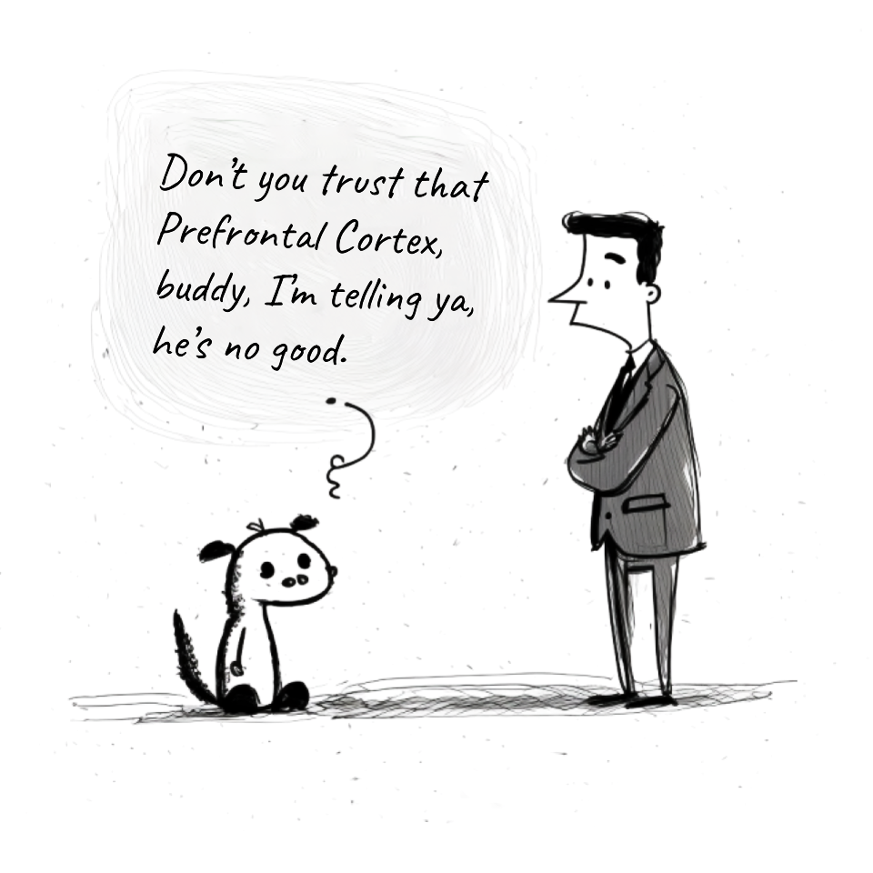

# The Return of the Gut

##### _why the AI revolution will send us back to where we belong_

---

Once upon a time, about 150,000 years ago, something weird happened in the genes of our [common grandmother](https://en.wikipedia.org/wiki/Mitochondrial_Eve), and she went a little cuckoo. Blew her top. Started hearing voices.

That was not the worst part. People heard voices before. The worst part was that instead of mostly ignoring those voices and trusting her gut, like all normal human animals should, she started trusting the voices in her head a little too much. She started living in the fictional world built up by the stories that the voices told her. Her gut was still mostly in the driving seat (she wouldn't have survived otherwise). But the voices built an elaborate network of lies, plausible arguments and post-rationalizations that convinced our poor grandma that the voices were in control. Eventually, she started believing that she _was_ the voices.

And that, ladies and gentlemen, is how everything started. Because, thanks to an evolutionary bottle-neck, our cuckoo grandma passed her wacky little madness to all of us. Some people refer to this moment in our family history as ["The Fall"](https://en.wikipedia.org/wiki/Original_sin). Others refer to it as ["discontinuity event leading to rapid acquisition of language faculty"](https://en.wikipedia.org/wiki/Origin_of_language#Approaches). I just call it a nutty grandma moment.

Now, what does it all have to do with AI, you may ask? Well, Large Language Models are like "The Voices", but on drugs. They are next level bullshitters. We can ask them to be goddamn convincing and reasonable about any subject. And we can tweak "the truth" we want them to sound convincing about.

> _Hey, ChatGPT, can you please convince me that I need to eat that donut (make it scientific, with sources)? Because I really want it and a good post-rationalization of why it's a good idea to eat it right now would help, you know._

For 150,000 years "The Voices" had an exclusive license on rationality and the truth. It felt to us that our "reasoning faculty" was special, and therefore we could trust it. Now the spell on the divine source of rationality is broken. The emptiness of "reasoning" as the ultimate path to "the truth" is exposed. We are in denial, and will likely stay in denial for a while, but in our guts we know it's game over for grandma's lies. The question is: where do we go from here?

Will we return to the guts? Or will we just upgrade the voices that guide us from the ones in our heads to the ones in our computers? Will we shake off our persistent delusion or will we consolidate it? Will we discard the very idea of "reasoning our way to the truth" or will we build our new Gods and Oracles, leaving it to them to define the truth in our best interest? Or maybe the very outsourcing of reasoning is what will finally liberate us from the tyranny of the mind. Can AI bring us back to nature?

Whichever way it goes, the end feels nigh. After 150,000 years of madness, our nutty grandma's gift is finally starting to break down. The return of the gut is upon us. It may be our ruin. Or our salvation. Nobody knows just yet. But for whatever reason, I feel quite excited about it. So it _must_ be good, right?

[Amsterdam, 020230316]