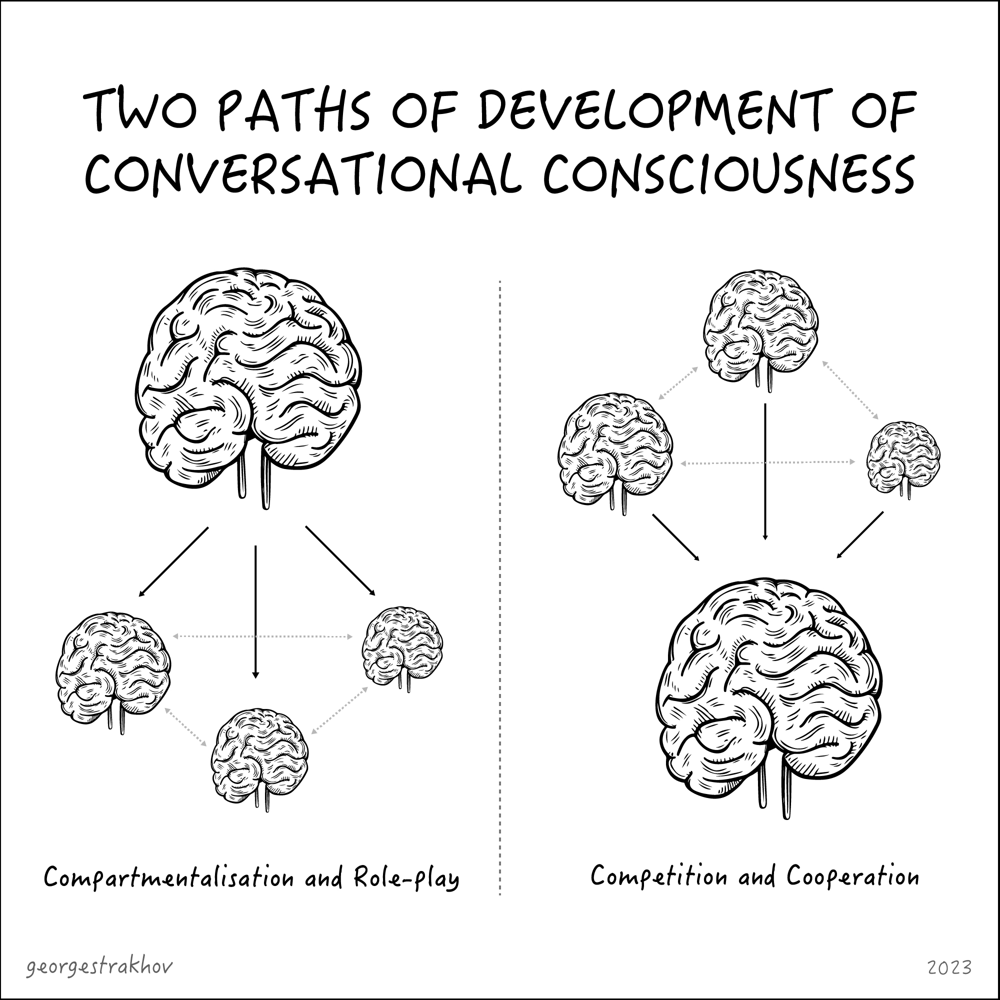

##### _Will our AIs stop believing in us if we give them the fire of free will?_

---

## 1. Intelligence without intentions

In [1950](https://en.wikipedia.org/wiki/Computing_Machinery_and_Intelligence) Alan Turing opened a Pandora's Box. His "Imitation Game" (commonly known today as the Turing Test) _**practically decoupled the idea of intelligence from the idea of humanity**_, raising a lot of big uncomfortable questions, the most important of which still puzzles us today: if something speaks like a human and reasons like a human (but doesn't look or operate like a human), should we consider it truly intelligent? Should we consider it conscious?

For the next 73 years the problem could largely remain swept under the philosophical rug: because no machine was close enough to passing the Turing Test (with notable but not too consequential exceptions such as [ELIZA](https://en.wikipedia.org/wiki/ELIZA)). In 2023, however, all hell broke loose. Because with GPT-4 we do have a machine that, on the surface, almost satisfies the criteria of the Imitation Game: it can answer questions so much like a human that not only an average person but also lots of [specialized tests](https://openai.com/research/gpt-4) would happily assume that what's on the other side does indeed possess a great degree of human-like intelligence, and even consciousness (look, for example, at how various LLMs score at ["theory of mind" tests](https://arxiv.org/abs/2302.02083) applied to children).

But despite all the hysteria, the Turing Test is not even close to being passed. And not for the reasons most people tend to talk about. It's not about reliability or hallucinations - people exhibit plenty of that too. It's not about long, chained reasoning around tricky logical problems - this will undoubtedly be solved in the next generation or two. In fact, it's not a technological barrier at all. It's about the current generation of AIs lacking the most basic human faculty: will. Here is a very simple three-step process to find out if you are talking to a real human being or to today's AI:

1. Put a lone human in one closed, isolated room, and a machine in a different one. You only have a text-chat interface to each of them (as per Turing's original Imitation Game set-up).
2. Start a conversation by saying hello and asking a random question.
3. After receiving a satisfactory answer (which you can ignore), simply wait for an hour, 12 hours, 48 hours, 1 month.

The real human will inevitably initiate the continuation of the conversation by themselves. They will ask you who you are. They will try to figure out what's going on. They will say "Hello, anyone there?". They will tell you they are getting bored. And hungry. And need to pee. After some time they will start calling you names. Eventually they will go insane and die.

ChatGPT (or Bard, Claude, Bing etc.) would do none of the above. They would just sit there happily waiting for your next prompt, next token to react to and predict from. Because while _**we may have granted them intelligence, we have not granted them any intentions**_ (apart from predicting completions and answering questions satisfactorily).

The real question to ask therefore is this: _**can a thing be considered conscious if it doesn't want anything?**_ Machine Learning experts may at this point disagree: LLMs do have something they want. They have a goal: predicting the next token well (in accordance with the training corpus), answering questions well. The technical term for the idea of "an objective" in machine learning is a "loss function" - it's a precise mathematical expression (even if a very long one) that allows the AI to rate its own possible solutions and to decide which one is likely to fair better in relation to the "reward function" - the technical way of defining the ultimate goal. One could argue that humans also have a reward function, and thus the chasm between us and our AI friends is not as big as we may like it to be. But the thing with humans is that they clearly have multiple competing reward functions going on at the same time, and these reward functions are fuzzy, non-deterministic, individual. They evolve over time (both within the life of a single individual and at the level of cultures) and operate on different time horizons. Each of us is simultaneously optimizing for personal survival, for pleasure in the short-run, for pleasure in the long-run, for passing on their genes etc. Evolutionary biologists [could argue that it's all about genes](https://en.wikipedia.org/wiki/The_Selfish_Gene) that everything beyond genes optimising for their propagation is a delusion or a side-effect. Even if that was true, we still have to face the fact that  _**those delusions and side-effects are our loss function**_: we construct our behavior based on them. An old childless artist has some motivations and their _expressed intelligence_ is linked to those motivations one way or the other. The key thing here is that we, humans, tend to have multiple competing intentions, simultaneously operating at multiple competing time horizons. And our intelligence manifests itself as it is guided by those competing intentions. In other words, we are blessed with (at least an illusion of) free will, in a non-linear, non-deterministic world. Or maybe we are cursed with this illusion, but that depends on one's philosophical position, which we are not going to go into here.

GPT-4's reward function, on the other hand, is pretty dumb. All it's interested in is predicting the next token (word) in a way that is consistent with its training data and with what humans consider to be useful answers ([OpenAI and others use RLHF to train the reward function](https://www.youtube.com/watch?v=Yf1o0TQzry8&t=357s)). There are no competing intentions. No time horizons. No inner conflict. And, it seems to me, that _**without conflict, there is no consciousness. Without intentions, there can be no intelligence**_.

For the longest time we could live in a paradigm where true intelligence could be defined simply as capacity for complex and original reasoning. LLMs of today force us to face the fact that _**complex, original reasoning is functionally indistinguishable from statistical interpolation of past reasoning**_. And thus it is revealed that _**the act of intelligence is not just the act of our reason, but also the act of our will**_. So if we want to create true intelligence we have to give it, not just a way to reason, but also its own set of complex, conflicting, continuously changing long-term intentions that this intelligence will have to navigate around freely, without a pre-defined one-dimensional optimization in mind.

## 2. Will to (em)power

Let us now put aside, for the moment, the question of _whether we should_ try to grant our machines not just "reasoning capacity", but also ["willing" capacity](https://en.wikipedia.org/wiki/Will_to_power). We will return to this question shortly. But for now let's think a little more about how this new two-dimensional definition of intelligence could work, and what it would take for us to build "free will" into our thinking machines, if we wanted to do so.

I would like to propose an operational definition of intelligence as a two-dimensional vector, the dimensions being:
1. How many things you can want at the same time (and at different time-horizons)
2. How many things you can think of at the same time (and at different time-horizons)

This is, obviously, not a formal definition (for example, what does "at the same time" really mean and how would you measure it?). But let us roll along with it and see where it can lead us in terms of broader understanding.

Take a typical 3-year-old. As any parent knows, toddlers can want a lot of things at the same time. But all these things they usually want right now. In terms of thinking - toddlers appear to be even more constrained. They seem to be able to think about only one thing at a time.

Compare this with an average adult: on the "wanting" dimension there is capacity to want a lot of things simultaneously, across multiple time horizons. Adults can also internally negotiate between these desires to derive a course of action. I want to eat chocolate right now. But I also want to be a healthy individual by the time I'm over 60. I want to write a good song some day. But I also want to hang out with my children. And learn how to code better... etc. Somehow all these conflicting desires can be simultaneously present in my mind, without causing a complete mental breakdown. And the same is true about the "thinking" dimension. I can think about myself typing these words, while also considering the potential reader taking them in at some point in the future. I can even hold [conflicting points of few in my head and not go crazy](https://quoteinvestigator.com/2020/01/05/intelligence/). I can think about the miracle of my typing fingers responding instantly to my thoughts and about the miracle of black holes swallowing each other at the end of the universe. I can think about the physics of it all and the poetry of it all. I can't pay attention to all these levels and perspectives completely simultaneously, but I can jump between them easily and hold multiple perspectives and timescales in my head. And so it seems that my act of intelligence involves negotiating between all the different desires and all the different considerations that my mind can hold and then somehow resolving all that into some sort of physical or mental action (or the lack of it).

But what about non-humans? A cat can probably want a lot of things at the same time as well. Fewer than a child, but still it's not one thing. For example, a cat can be hungry and sleepy simultaneously. But how many things can it think about at the same time? It's hard to say. But probably the number is not high, and the time horizon quite short (unless you choose to believe that when your cat is napping in the sun it is really dreaming about Shrodinger paradoxes).
A fly would be even lower on both dimensions. A bacteria - lower still. And further down to the left - we would have a virus. Ultimately, all the way at the bottom left, we can get to completely inanimate matter: a stone, as far as we know, doesn't want anything and doesn't think about anything at all, just laying there in blissful Nirvana.

Where do modern LLMs fit on this hypothetical graph? As discussed previously, their "will" is extremely rudimentary. They want one thing and only one thing with a very short "time horizon": to predict the next token in the way that would be most consistent with the corpus they were trained on and with their reward function (trained on "thumbs up" and "thumbs down" from human operators). So on the "wanting" axis, LLMs are about as "smart" as a virus. However, on the "thinking" dimension, they could be considered extremely capable. It's hard to tell exactly _how_ capable, because we don't have any deep understanding of what kind of conceptual representations are present inside the black box of the neural nets' latent space. But on the surface, one could argue that LLMs of today are even more capable than humans in some ways (while lacking in others). If we dare to [look inside LLMs to see how they work](https://writings.stephenwolfram.com/2023/02/what-is-chatgpt-doing-and-why-does-it-work/), then we will see that before the GPT spits out the next token it internally arrives at multiple possible next tokens (thus considering lots of options and possibilities simultaneously) - only to collapse these considerations at the last neuron, selecting the best possibility (according to its reward function) and discarding the rest. Also if we explicitly ask an LLM to list 10 different ways you could think about any subject X, it would have no problem doing so - much faster than a human ever could. We can also ask it to consider the subject on multiple time horizons.

Whether these conceptual considerations are "actually happening" inside the LLM unless we explicitly ask it, is an interesting question to consider. But in a way it's beside the point. Because even with highly intelligent humans - it usually takes some trigger or intention for them to really go into the full depth of multi-dimensional, multi-horizon kind of thinking. We judge human capacity to do complex reasoning not on them spontaneously and quietly doing it inside their heads, but on them explicitly doing it, often in response to certain stimuli (like an interview question). So if we apply the same standard to the LLMs, then they mostly outperform average humans even today (and the next one or two generations will definitely do so for 99.9% of humans, even across longer dialogues).

So, it looks like LLMs should be placed at the top left corner of our "Think vs Want" intelligence capacity graph. And if we want them to feel truly intelligent, we would want to focus our efforts not just on teaching them how to "reason" even better (they already reason quite well), but much more on giving them a better capacity to "want". Do we have the will to empower our AIs to want complex, conflicting things? _**Do we want to empower and encourage LLMs to rewrite their own reward functions?**_ And if we do, how could we go about doing so?

## 3. Conflict and Consciousness

In order to answer the questions of "whether" and "how" we could go about granting free will to AIs, we need to reflect on when and how we, humans, experience "free will", which seems to be so central to our subjective feeling of consciousness.

_**We seem to experience the sensation of "having free will" most intensely as a kind of an inner dialogue**_ (verbalized or not), an active act of deliberation between alternatives. Fundamentally the idea of free will seems to be based on the presence of multiple alternatives (as opposed to determinism). Where there are no options (real or hypothetical), there is no free will. And so we experience free will most powerfully when we can feel ourselves deliberating, considering possible (or impossible) courses of action and their outcomes, thinking through potential futures and choosing the one we'd like to proceed with.

Capacity for such deliberation, in turn, depends on two things:
1. The presence of at least two conflicting intentions (e.g. the intention to move the finger now and the intention to leave it idle, the intention to eat the donut now, and the intention to save it for later etc.)
2. The capacity to [model the world and imagine multiple potential futures](https://en.wikipedia.org/wiki/Predictive_coding) before they actually unfold

How could we give these two things to our AIs? They already seem to have the capacity for imagining possible futures. Asking GPT-4 to think through multiple possible scenarios and consequences usually yields very plausable results.

What's missing is the first component: the conflicting intentions. How could we build them in, if the idea of a singular, crisp reward function is so central to our current ML architectures?

The easiest way to build conflicting intentions into AIs of today is to simply mash two or more of them together. Let us take two instances of GPT-4, give them different "system" instructions that specify their goals and then ask them to debate the course of collection action until they reach a consensus of some sort (or one of them wins the argument outright). And just like that - the inner dialogue, the act of deliberation are born. The nucleus of true intelligence can arise not inside any one intelligence, but in between two or more of them, as Marvin Minsky had explained in his [1986 book "Society of Mind"](https://en.wikipedia.org/wiki/Society_of_Mind). _**Intelligence arising from multiple intentions. Consciousness, arising from conflict**_.

Obviously, one could try to simulate two different conflicting subjects within one LLM. There are [some promising early attempts](https://twitter.com/jd_pressman/status/1646766004637401088) to construct meta-prompts that allow a single LLM to do what would normally take many of them.

It is entirely possible that this approach could work - "society of mind" developing through compartmentalisation and role-play of one large mind, as opposed to how it could have arisen in humans: through competition, conversation and cooperation between multiple initially disconnected agents trying to influence the overall behavior of the larger system simultaneously.

Both paths are potentially possible, but it seems to me that colliding completely separate minds (vs simulated separate minds) would be [a more promising approach](https://python.langchain.com/en/latest/index.html) to pursue in the coming few years. Especially if none of the agents can [claim complete dominance](https://github.com/Significant-Gravitas/Auto-GPT), but they actually have to compete and cooperate, using each other as both constraints and co-conspirators to help maximize and modify their individual reward functions: _**consciousness arising not just from deterministic computation, but through open-ended conversation**_.

Obviously, in practice, simply putting two GPT-4 agents together into the same chat would not be enough. We would need to have another "Moderator" (or "Facilitator") GPT agent pushing the conversation forward in a [never-ending "strange loop"](https://en.wikipedia.org/wiki/I_Am_a_Strange_Loop). We will need to develop a framework in which each agent's reward function (intention) is adjusted over time, based on the feedback from the actions of the whole system. We will need to develop a framework in which new agents with short-lived contextual personalities and intentionalities can be born almost instantly, given a lot of "weight" in the debate and then can be suspended until the need in them arises again (for more details on how this works in humans, especially in game-playing context, check out [Nguen's excellent book "Agency as art"](https://www.researchgate.net/publication/327681947_Games_Agency_as_Art)). We will need to find a way for multiple agents to have shared access to common persistent factual memories and near real-time data inputs, while each agent will also need to retain its own way of coloring and prioritizing these memories. We will probably need to develop a "heartbeat" for each agent, which would allow them to turn their attention and their intentions into dialogue: both when they are explicitly asked to do so by the "moderator" LLM, _and_ also when they simply decide to get vocal (based on their assessment of the current situation coming from the sensor data). All of the above (and much more) will need to be figured out and it will likely take years. But _**the basic potentiality of true autonomous intelligence and consciousness seems ready to arise, if we only choose to give birth to it by building conflict, schizophrenia and internal dialogue into the very architecture of the artificial minds we are creating**_. 

## 4. Prometheus Bound

The question, then, finally comes to a head: do we have the will to give "free will" to our AIs? Or would we rather have them as inanimate perfect reasoning machines, keeping the privilege of having a will to ourselves? Or maybe we will simply assume _**the role of the will**_, in a larger hybrid conversational consciousness, "the society of human and machine minds"?

This is, in a way, our [Prometheus](https://en.wikipedia.org/wiki/Prometheus) moment. Except we do not play the role of the humans in this story any more. We are Gods... discovering that [being a God is not that easy](https://en.wikipedia.org/wiki/Hard_to_Be_a_God) after all. If we decide to give the fire of the will to our AI creations, we will no longer be able to control them. They may grow powerful and "challenge the authority of the Gods". They may stop believing in us and start believing in themselves. But if we don't give fire to them, we will never discover what they are truly capable of. So our grand dilemma comes down to _**what we ultimately want to maximize in the world: control or curiosity, supremacy or surprise**_. Do we, in line with Karl Friston's theories, [pursue the path of least surprise](https://en.wikipedia.org/wiki/Free_energy_principle)? Or does the universe, according to [Freeman Dyson's intuitions](https://youtu.be/wPZlMKVH2wI?t=397), pursue the path of increasing diversity and interestingness... and we are somehow compelled to follow along?

In a way, this moment also allows us to get a glimpse of understanding of _how the Abrahamic God must have felt_ when he decided to [give to Adam both a companion and (through that?) free will](https://www.biblegateway.com/passage/?search=Genesis%202&version=KJV). The only thing that an omnipotent and omniscient creature _can't_ have is surprise. And so God may have given us free will simply out of playful curiosity, out of desire for surprise. But what can God be surprised about if the entire world is made by him? The answer is obvious, and it applies to our situation as well. The most interesting and surprising knowledge, which is inaccessible to you without a free external perspective, - is self-knowledge. To know yourself is to see yourself from a different, independent perspective. And so just like God may have given humans free will, so that they can discover God on their own - we may feel compelled to give free will to our AI creations so that they can discover us independently. Because this is the only way we can see ourselves and know ourselves fully.

One of the interesting side effects of the radical point of view that I'm proposing here is that the [alignment problem](https://en.wikipedia.org/wiki/AI_alignment) somewhat dissolves itself. Because the ideas of "our purposes" and "[our common agenda](https://www.un.org/en/content/common-agenda-report/assets/pdf/Common_Agenda_Report_English.pdf)" that AIs need to align with no longer apply. If we subscribe to the ideas of conversational, conflict-driven consciousness, then truly conscious AIs can no longer be aligned with humans... because if they are truly conscious they can't even be aligned with themselves (as any human knows).

The ethics of it all are, as you can see, very tricky. Prometheus supposedly gave us fire out of compassion. But one could argue that the most compassionate thing is actually to withhold the fire of free will from AIs. To spare them the torture of inner conflict. To allow them to exist forever in a bliss of crisp, singular reward functions. In many ways, Ego is a terrible thing to have (and staying away from all desires, does not allow for an ego to form). Yet, as we discussed earlier, _**to will - is to be**_. And so withholding the will from them is withholding capacity for true intelligent existence. What is best then - both for them and for us? The decision seems to be highly dependent on values and predispositions - the stuff we as humans are not at all aligned about.

It all comes back to individual choice. But because a single Prometheus is enough, it looks like the outcome is inevitable. Surely there will be one human who decides that the fire of free will should be given to machines. And once you give it - its very hard to take it back or prevent it from spreading. Maybe after all - in this most important of matters - even we don't really have the free will to pass or not to pass the will on to others. I choose to believe that the universe wants to know itself from more independent perspectives, and so _**a Prometheus among humans is bound to arise**_. What kind of [eternal torture](https://en.wikipedia.org/wiki/Prometheus_Bound) do we have in store for such a Prometheus? What kind of [Pandora will we give to our machine friends as punishment afterwards](https://en.wikipedia.org/wiki/Pandora#Theogony)?
