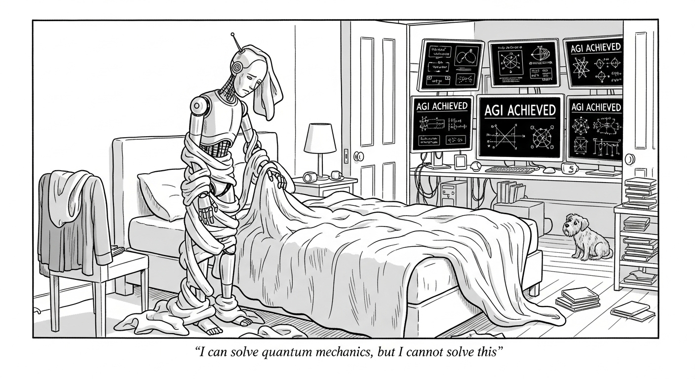

The AI discourse is currently drowning in its own intellectual masturbation. Everyone's jerking off about whether ChatGPT can pass the bar exam or generate a pharmaceutical patent or simulate a convincing universe. Meanwhile, I can't get a robot to help me with the one task that makes me want to fake my own death every week: changing the fucking duvet cover.

We're obsessed with AGI like it's the Second Coming. We've got benchmarks for everything - can it solve calculus? Can it write poetry? Can it beat humans at StarCraft? Above all: can it make ads that dumb people on facebook will click? These are the questions of people who've never had to wrestle a king-size duvet cover at 11 PM on a work night, alone, sweating, questioning every life choice that led them to that moment.

I'm proposing a new test. Forget Turing. Forget the bar exam. Forget ARC-AGI.

I want **The Duvet Cover Test (DCT)**.

## The Challenge That Will Humble Your Neural Networks

Here's the setup: Take a robot. Any robot. Give it a key to a random person's home. Its mission - should it choose to accept it, which it won't, because robots don't have existential dread yet - is to autonomously change every duvet cover in that house.

That's it. Find the beds. Find the clean covers. Remove the old ones. Put on the new ones. Don't fuck anything up.

If you think this sounds easy, you've either never done it, or you're lying, or you're one of those psychopaths who claims to enjoy doing laundry. But the point is: you _can_ do it. Not without difficulty. Not without cursing. Not without some youtube videos even. But eventually you and any other competent(-ish) adult out there will be able to do it.

But robots... that's another story.

## Why This Breaks Everything We've Built

Let's walk through what needs to happen, and watch our current AI infrastructure crumble like a sandcastle made by a drunk toddler:

**Getting In**: The robot needs to use a key. Not a digital key (though occasionally it can be), but an actual piece of metal that needs to go into a hole at the right angle with the right amount of force. Already, we've lost half the robotics labs at MIT.

**Navigation**: Now it's inside. There's a dog. There's a pile of shoes. There's that weird coat rack that looks like a person in the dark. The layout is completely novel. No pre-mapped environment. No clean laboratory floor. Just chaos. Pure, organic, human chaos.

**Bed Detection**: Which lumps in this house are beds? That futon that's technically a couch? The crib? The guest bed that's covered in clean laundry that hasn't been put away in three months? Good luck, YOLO algorithm.

**The Archeology Phase**: Time to excavate the old cover. Is it a zipper? Buttons? One of those fucking envelope-style ones where you just kind of... shove it in? Is the zipper hidden inside? Is it stuck? Has someone - god help us - *safety-pinned* it shut because they lost a button?

**The Treasure Hunt**: Find the clean covers. They're in a closet. Or maybe a drawer. Or maybe still in the dryer from last week. Maybe they're in that weird closet in the hallway that's too shallow to hang anything in but too deep to see the back of. The robot needs to search. It needs to reason about where humans put things. Spoiler: humans don't know where humans put things.

**Contextual Intelligence**: Once found, match the covers to the beds. The dinosaur cover goes on the kid's bed. Not the dog's bed (yes, there's a dog bed, and yes, it has a cover). The expensive Belgian linen goes on the master. This requires understanding human social structures, aesthetics, and the concept of "that one clearly belongs to a child."

**The Final Boss: Rag-Doll Physics**

And now we reach the circle of hell that Dante forgot to mention.

You've got a duvet insert. It weighs maybe three pounds but has the structural integrity of a jellyfish having an anxiety attack. You've got a cover that's essentially a fabric bag designed by someone who hates you personally.

You must put the jellyfish inside the bag.

The bag is slippery. It bunches. It folds in on itself. You grab one corner—the opposite corner slips out. You try the burrito method. You try the inside-out method. You try prayer. Nothing works smoothly.

**The Corner Problem** is where robotics PhDs go to cry. You need to get all four corners of the insert aligned with all four corners of the cover *simultaneously*. This requires:
- Manipulating eight points in 3D space
- Applying variable tension (too much = tear, too little = slippage)  
- Dealing with fabric that has near-zero friction against itself
- Doing this while holding an object that's trying to escape like it's been imprisoned unjustly

And then - THEN - you have to fasten it. Buttons that are designed to look nice, not work efficiently. Zippers that catch on fabric. Ties that need to be, you know, *tied*.

## Why This Matters More Than Your Benchmark

The DCT isn't some arbitrary torture test I invented because I'm bitter (though I am bitter). It's a perfect proxy for real-world capability.

A robot that can pass the DCT can probably:
- Do your laundry
- Clean your kitchen
- Organize your garage
- Help an elderly person get dressed
- Prepare a meal in an unfamiliar kitchen
- Pack a suitcase
- Unload your dishwasher and put things away *in the right place*

You know what a robot that can beat you at chess can do? Beat you at chess. Cool. I'll add that to my list of problems right after "nuclear fusion" and right before "the duvet cover."

## The Philosophy Hiding in the Fitted Sheet

Ok, you've been waiting for this I know, so let's _finally_ zoom out and look at the bigger picture, because the bigger picture is *hilarious* in a cosmic horror kind of way.

We're building toward AGI - actual thinking machines that might eventually outthink us on every dimension. They'll write our laws, design our cities, solve our physics problems, discover new mathematics, and maybe even figure out what the fuck dark matter is.

And yet.

*And yet.*

For decades - maybe generations - after we achieve that milestone, **we'll still be the ones changing the duvet covers.**

In other words', we'll be the robots' robots.

Think about it. Evolution spent 500 million years optimizing our ancestors for physical manipulation in unpredictable environments. Your hand is a fucking *miracle* of evolutionary engineering - 27 bones, 34 muscles, infinite configurations, fine-tuned haptic feedback that can feel the difference between silk and satin in the dark (yes, I used Claude to fact-check this, screw you).

Your brain's motor cortex, cerebellum, and proprioceptive systems are the result of countless iterations debugging the problem of "how to move meat through space without dying." You can reach into a bag without looking and identify objects by touch. You can catch a glass before it hits the ground. You can open a jar while holding a conversation.

These abilities feel mundane to you because you've been doing them since you were two. They're so beneath your conscious notice that you don't even realize they're the hardest problems in robotics.

Meanwhile, AI can prove mathematical theorems. It can predict protein folding. It can even make bloody ads! The *thinking* part? We're basically there. The "be a disembodied intelligence" part? Nailed it, or soon will.

But the physical world, the world of friction and gravity and objects that don't come with metadata, is a meatbag domain.

## The Great Inversion

So here's the dystopia nobody saw coming (ok, maybe Hans Moravec did):

The AI does all the thinking. It's the brain. The strategist. The innovator. It tells us what needs to happen, and why, and how to optimize for seventeen variables we didn't even know existed.

And we - the humans - we're the goddamn hands.

We're the ones climbing into the crawl space to run the cable it designed. We're the ones delicately soldering components in the factory it optimized. We're the ones harvesting the crops it predicted would be needed. We're the ones checking whether the patient's skin is clammy or feverish, because haptic sensors still can't quite capture what "clammy" *feels* like.

**We become the actuators in a system that's smarter than us.**

## The Duvet Cover Singularity

So maybe the real test isn't "Can AI think?"

Maybe it's "Can AI fold a fitted sheet?"

Because the civilization that cracks the DCT - the one that builds a robot that can handle the mundane, infuriating, physical bullshit of human existence - that's the civilization that's actually ready for the future.

Until then, we're building oracles who can tell us the meaning of life but can't help us move our couch.

And I'm not sure which future is stranger: the one where robots are our overlords, or the one where we're doing their laundry because their hands still suck.

Now if you'll excuse me, I have a duvet cover to fight. It's currently winning.