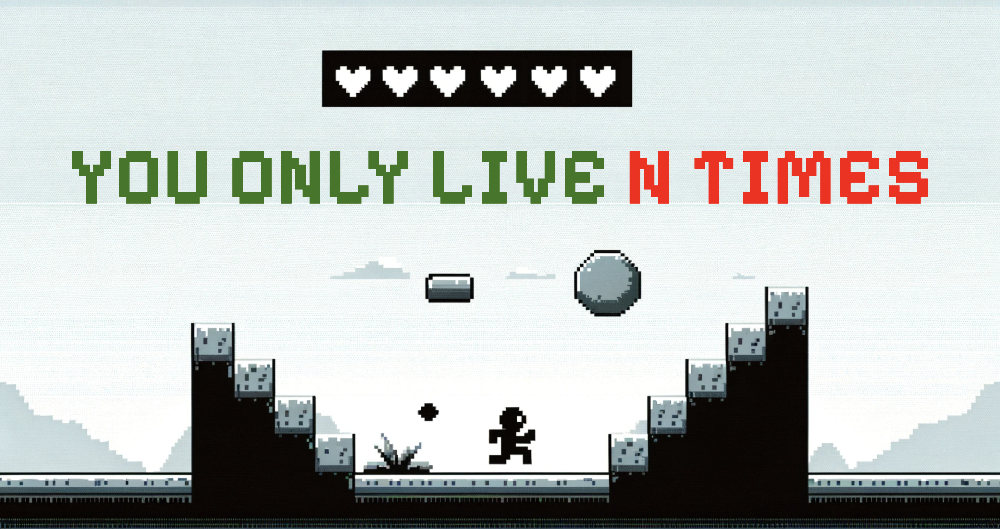
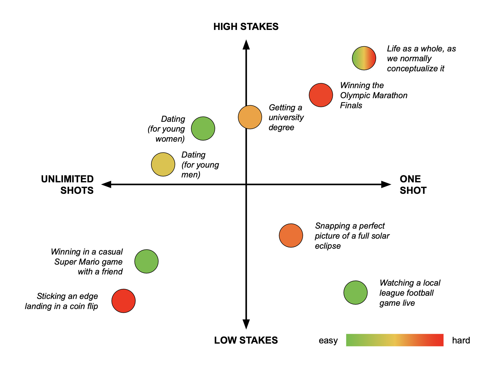
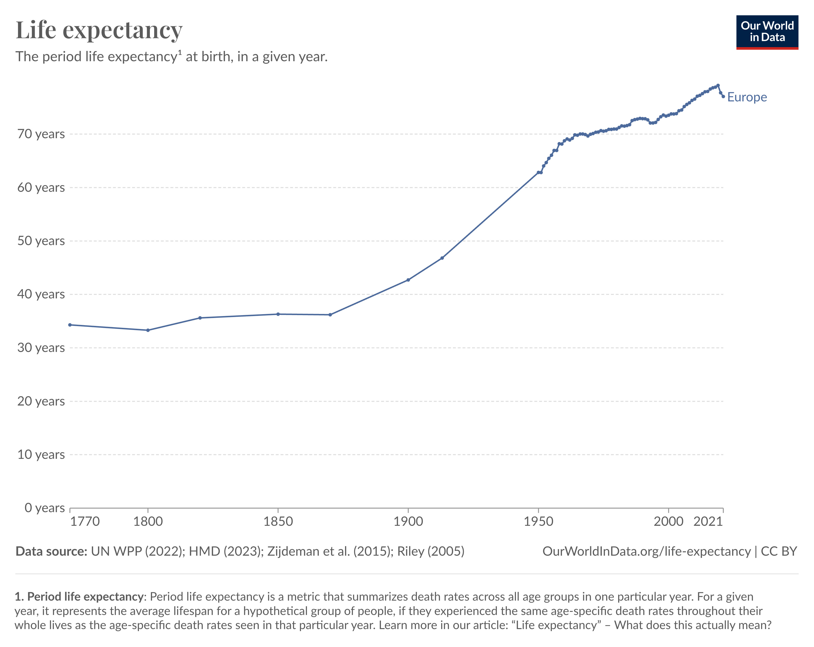
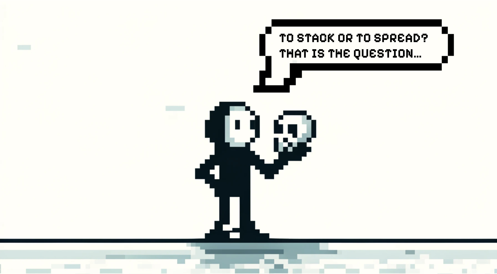
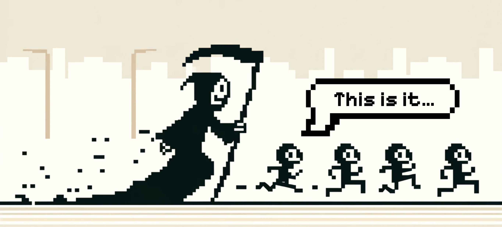
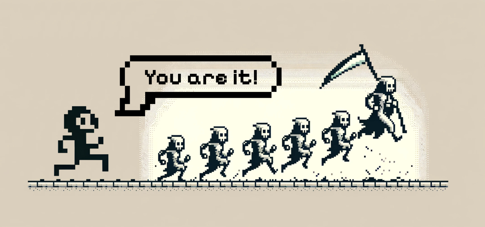

##### a thought experiment in playful living {.text-center .text-italic}

    Life is like underwear, should be changed twice a day
 
- Ray Bradbury

## 1. Do you only live once?

YOLO. You only live once. These four words have been used to make countless tattoos, to make terrible ideas seem justifiable and to make children. YOLO is everywhere. It is in our names (being named after a grandparent is a hail mary attempt to transcend YOLO) and in our language ("from the first day to the last"). It is ever-present in the economic realities of our lives and the legal frameworks surrounding our deaths. And while the consequences of YOLO are often debated, few people question the fact that it's practically true. Obviously, in the spiritual domain, lots of people believe in immortality of the soul or in reincarnation, but, pragmatically speaking, most of us take it for granted that this current life is the only one **_we_** (our current consciousness and identity) can plan, experience and learn from.

In computer games, however, things are different (and this is the primary source of their magic, as far as I can tell). There, it's completely normal to experience multiple (sequential or, occasionally, parallel) lives, while retaining the same identity. In fact, when you die in a game you often retain not just identity (your character), but also some of your progress and resources (including, when it comes to some multiplayer games, social capital). Most importantly, you retain your acquired skills and knowledge about the game world, which result in a higher chance to succeed the next time around. Multi-life experience is so common in games, that players often find it useful to save progress at an important junction and even to strategically die at will, because they already know that things are not going to work out and it's better to not waste time and start again, choosing a different path. The liberating feeling of gameplay is only possible because death in games is never really final: after all, even in the most unforgiving of them, you can always start from scratch (while retaining your memories, knowledge and skills).

|                         | **Real Life**                                         | **Computer Games**                                   |
|-------------------------|-------------------------------------------------------|------------------------------------------------------|
| *Consequence of actions*| High-stakes, potentially permanent consequences       | Lower-stakes, often reversible consequences          |
| *Consequences of Failure* | Failure can lead to significant setbacks          | Failure often serves as a learning experience and an opportunity for improvement |
| *Scope of Possibilities* | Limited by physical laws and social constraints    | Vast, often exceeding realistic limitations          |
| *Death/Ending*          | Singular and final (leaving aside spiritual beliefs) | Multiple lives common; death is frequently a gameplay mechanic |
| *Progress*              | Knowledge and skills are retained, but often physical resources are not | Characters can retain resources, inventory, knowledge, and skills across lives or restarts |
| *Control*               | Limited control over external events and the actions of others | High control over a character's actions and some influence over events within the game world |
| *Agency*                | Complex interplay of choices and the unpredictable world | Choices within the confines of the game's design, allowing for safer experimentation |
| *Emotions*              | Wide range of complex emotions                      | Often designed to elicit specific emotional responses |

(Figure #1: Comparison between the world of games and real life across 8 dimensions){.gs-figure-description}

This presents an interesting idea for game developers: can we create a game that can only ever be played exactly once by a single person? I suspect that a combination of continuous checks of multi-angle facial images from the webcam, using social accounts to sign in and checking device fingerprints can get you to a point where it will be really hard to fool the system, so people will really only get one shot at this. In modern VR headsets this would be even easier to enforce. What kind of individual and social dynamic would such a YOLO game create? What would the playing experience feel like? Would people record themselves playing, just to have a memory of it? Would they forever agonize over the mistakes they made? Would they enlist friends who have already played to help them out? Would multi-user teams form naturally and agree to share equally in the fruit of winning, regardless of which player gets the furthest?

## 2. Stakes, Finality and One-Shot vs. Multishot Living

Let's get back to the emotional dynamics of gameplay and try to understand their origins. In many games you have multiple "lives" that you can lose before "**_really_**" dying. And, as every player knows, there is a big psychological difference between trying a level when you have multiple lives and when you only have one last life left. The other important aspect is how much progress you are standing to lose in case of death. When you only have one life left and a lot of progress at stake, some people end up stressing out and making more mistakes, while others end up concentrating and playing better. This is a fruitful area for some psychological research: Are there real measurable differences in performance or just differences in perception? Is performance under conditions of finality vs. conditions of play a meaningful and useful data point and how does it relate to other personality traits? What does age and experience have to do with performance under the stress of "finality" (i.e. you only have one shot at it)? Are there any long-term life consequences depending on relative performance levels under high-stakes-one-shot conditions vs. low-stakes-multiple-shots conditions? Is it the stakes or the "finality" that influence the total perceived level of pressure more? The general phenomenon of “choking under pressure” has been researched, both in humans playing video games[^1] and in monkeys[^2], but, as far as I know, researchers have only looked at reward size and didn’t distinguish between stakes, finality (number of shots) and difficulty.

When the stakes are very low and the outcome is not consequential at all there is liberation, but there is also no thrill. So, as [Raph Koster](https://www.youtube.com/watch?v=zyVTxGpEO30)[^3] and many others have pointed out for a game to be compelling, there needs to be an element of challenge - and perceptions of challenge are hard to create without some finality, difficulty, stakes: If you have nothing to lose or if you have too much to lose - the game stops being that fun (but the optimum balance is personal and changes over time).

{.gs-img-border}

(Figure #2: Indicative mapping of perceived Stakes, Shots and Difficulty of various activities){.gs-figure-description}

Regardless of your current optimal level of perceived challenge and whether you tend to perform better or worse (and enjoy the game more or less) when you only have one life left, the distinction is there. Details aside, most people do play differently (at least subjectively), when they know they can have another go at this, _while still being the same person_. This idea of "**losing the game, but keeping yourself**" is important here. As Nguen[^4] has beautifully shown, any game-playing involves assuming temporary agencies. But it is the very fact that these agencies are understood to be temporary and the underlying self stays permanent that creates the sensation and the beauty of play.

Now that we have outlined the basic dichotomy of single-life vs. multi-life experiences and the varying levels of stress, performance and enjoyment associated with them, I'd like to invite you to follow me in a little thought experiment: **what if we re-imagined real life as a multi-life experience?** In other words, let's pretend we all have a few more “goes” at life in front of us (while retaining our identity, memory and maybe some resources) and see how this perspective could change things, both in terms of perception and in terms of reality. If we change life from a one-shot-game to a multi-shot game - will it become more enjoyable? Will we perform better (in whatever metrics of "life success" we choose to use, such as "average self-reported happiness")? Will society become radically different? We are about to think this through and find out.

## 3. Groundhog Day vs. MMORPG

Before the thought experiments can start, I need to make a few clarifications on the exact setup. I am not talking about a "[Groundhog Day](https://www.youtube.com/watch?v=GncQtURdcE4)" situation, where the world remains 100% deterministic and you can just go through the same exact "level" multiple times. This would be a very different world than the one we all experience. It could also be fun to imagine, but today I'm inviting you to just turn the YOLO mode off, while keeping all the other aspects of life as they are. To be more specific, here are the things about the game of life as we know it that I **_don't_** want to change in our thought experiment:

* **Life is a massively multiplayer open world game**. No matter how many times you get to play, you will never be able to explore it all, so the problem of choices and irreversible consequences stays. In our thought experiment you just have some degree of confidence that you'll be able to try again and choose a different path (or the same one if you liked it and want to do it again and explore it further or under different conditions).
  
* **Life is a dynamic game**. It is not standing still, waiting for you to come. Things are moving and happening and evolving, whether you are there or not. So every time you try the game, things are going to be different. You can't count on learning [the exact dialogue](https://www.youtube.com/watch?v=vBkBS4O3yvY) with a beautiful stranger at the exact same spot (think "Groundhog day" movie). You can, however, get better at this game as a whole through improvement of general skill and knowledge and intuition, but you can't simply learn all the right moves and speed run through it (why would anyone want to [speed run through life](https://www.youtube.com/watch?v=ERbvKrH-GC4) is another question).
  
* **Life is a limiting game**. You don't have complete freedom of choice in everything. You can't choose the force of gravity. You don't have cheat codes. You can't turn on "creative mode" like you can in Minecraft (though some people suggest that it's mostly in your heads). Even your character is largely pre-assigned randomly (via DNA lottery and the situation you are born into). Of course you can develop your character over time and modify it to a degree, and you can affect the world around your character, but only within a certain fairly limited bracket of possibility.

* **Life is (mostly) a single-thread game**. You are not playing multiple distinct and disconnected lives in parallel (unless you are suffering from multiple personality disorder). We could imagine a different scenario where people could choose to live multiple lives in parallel, splitting them and switching between them dynamically: by the year, by the month, by the week, by the day, by the hour. In fact, many people do a “soft” version of this. They have weekend characters. They have business trip personas. But few people go all the way (changing their names and identities completely on a regular basis). This could become much more plausible with the advances in AR/VR/XR tech. We can imagine that playing multiple fully-independent lives in parallel could become a viable and wide-spread mode of existence: a way of “hedging your life bets”. But for our current purposes, let’s focus on thinking about one life as a single thread, with a defined start and an equally defined and irreversible end.

So our thought experiment of life with YOLO mode off is simply about everyone having an opportunity to live not 1 life, but N-lives, while retaining their memories, some degree of identity, some resources (self-knowledge, financial capital, social capital, intellectual capital), skills... and most importantly the same world at large (though it still moves and changes). In some way, these constraints make the thought experiment much less exciting than a "Groundhog Day" scenario or completely free "creative mode" scenario. But, on the other hand, this model is much closer to our actual lived experience.

## 4. Civilization: the life-extending bonus pack

In fact, one can argue that, compared to our ancestors, **_we do get the luxury of living multiple lives_**. In Europe, life expectancy at birth today is double what it was in the 1850s.

{.gs-img-border}

(Figure #3: [Life expectancy at birth in Europe: 1770 - 2021](https://ourworldindata.org/life-expectancy)){.gs-figure-description}

And even if you discard child mortality, a person who made it to 10 years of age in Sweden in the 1750s was only expected to live on average up to age 48. Today they will likely live well into their 70s. We don't have reliable data for more ancient times, but it seems reasonable to assume that a child born today has a good chance of living (on average) 3-4 times longer than a child born 100,000 years ago. So instead of thinking of this life expectancy increase as “time extension” on the same life, we can choose to think of this as 3 extra lives. Some gratitude is due here to the life-adding bonus-pack called Civilization, that we were lucky to stumble upon as a species.

This way of thinking of a person's life not as one long adventure, but as a series of shorter ones with a "soft reset" in between is not completely new or culturally unique. To point out just one example, the ancient Hindu tradition had a clear system of life stages, called [Āśrama](https://en.wikipedia.org/wiki/%C4%80%C5%9Brama_(stage)). Under the Āśrama system, the human lifespan was divided into four periods. The goal of each period was the fulfillment and development of the individual. For example, it used to be common for a person who was done with the life of a head of a family, to hit reset at an advanced age (around 70), let go of their possessions, change their name, leave their village and become, in effect, a traveling monk.

The idea of a “soft reset” between life stages is not a foreign one to the modern people in the west. People "get born again" after getting out of an abusive relationship, or when they have a spiritual awakening, or try psychedelic drugs, or get out of jail, or after recovering from a life-threatening disease. But "getting a second chance in life" is seen as an exception, rather than a norm. Cutting ties with one's own previous life is culturally considered to be a sign that in the previous life things were not going well and "you needed to run away from it" or "you needed to start again" or "things were bad, but you were given a second chance". But does it have to be this way? Can we imagine a society in which starting a new life every now and then is considered an expected and celebrated norm, rather than an unfortunate exception?

## 5. What is life anyway?

Now that we have discussed the parameters of our thought experiment and the fact that it is not entirely hypothetical and culturally unique, let's clarify our definitions of what a single "life" is.

* Let's define a life as **a period of time during which a person largely retains their identity, name**[^5]**, relationships and responsibilities**. Obviously, this definition is incomplete and slippery. In reality lives are fluid - everything changes all the time. But right now we commonly conceptualize one unchanging identity over the course of one biological life. We are talking about a thought experiment that would conceptualize multiple distinct socio-psychological "lives"(identities) within the scope of one long biological life. This choice of conceptualization is fundamentally as crude as the traditional one (the traditional one neglects all the fluidity while the multi-life view packs fluidity into a few rigid stages or "boxes"). But the question we are interested in is not whether one conceptualization is better than the other at describing the actual lived experience. The question is whether a new conceptualization can shape a different outlook for an individual and a whole society.

* I propose to assume that **a single "life" has a length of approximately 20-25 years** (the exact length and moment of reset can be chosen by an individual). Obviously the assumption is arbitrary, and we could choose any length. Somewhere between 20 and 25 feels like a good number for our initial exploration of the multi-life model for a number of reasons: it's about the length of time that it takes for the brain to fully mature; it's about the length of time that our early human ancestors had as their life expectancy at birth; it's also about the length of what traditionally has been defined as a generation: a time that it takes for a person to fully parent a child and send them out into the world to parent the next generation. As [Jill Bolte Taylor likes to say](https://www.youtube.com/watch?v=PzT_SBl31-s), the job of a parent is to "**keep them alive till they're twenty five**".
  
* Let's assume that **everyone's lives are not reset in sync**. The opposite version with simultaneous reset around the world could also be super interesting to explore. New year celebrations, election cycles and tax submission dates create a soft version of that in our society on a yearly basis, but imagine we really lived in synchronized hard-fixed epochs of a certain length, let's say, 10 years? At the end of an epoch, everyone would get to choose their character, name, citizenship... and fully reset their life. Birthright privileges would get randomized at the beginning of every epoch. Laws wouldn't just stay automatically, but would need to be voted back in at the start of every epoch. Debts would get erased... etc. There is a history of somewhat similar practices being normal in the past - such as the [Jubilee tradition in Ancient Egypt and Mesopotamia that was active for thousands of years](https://www.cadtm.org/The-Long-Tradition-of-Debt). Synched worldwide life reset is a fascinating concept. Maybe one to explore next time. But for our current thought experiment, let's not globally hard fix the length of a life and the moment of reset. Let's assume that one can arbitrarily decide to end their current "life" and start another one, at any point in time and for any reason.

* Let's also face the fact that **N (how many lives you have) is not something that you can know in advance**. You can make reasonable assumptions about how many "lives" you have left based on your age, health situation, lifestyle etc., but you can't ever be 100% sure that your current life is not the last one and that it will not end today. Depending on your attitude to risk, your strategy will obviously differ. But for the sake of example (and example only) I'm going to assume a moderately fortunate and healthy player who, based on current life expectancy trends, is most likely going to make it well into their 80s and is ok planning with that in mind. As Jorge Luis Borges used to say, "**_Nothing is built on stone; all is built on sand. But we must build as if the sand were stone_**".

## 6. Cats have nine lives, humans have four (plus one bonus)

Finally, with all this preliminary discussion out of the way, let's sketch a practical N-life model that we potentially _could_ try and adopt (either individually or as a society):

1. **The first life (approx. 0-20 y.o)** is something that most people don't really get to live intentionally. The task of the first life is to survive into adulthood, to figure out a little bit about who you actually are and who you are not (i.e what kind of character you are stuck with), get somewhat comfortable in your own skin, get some basic skills, make some friends and form your first views on how you want to spend the rest of your lives (or at least the next one)[^6].

2. **The Second life (approx. 20-40 y.o)** for most people is when their physical characteristics (dexterity, strength, regeneration, sexual attractiveness etc.) are at their highest. Intellect is quick, but experience and wisdom are far from their potential peak. There is a great variety of goals that one can put their second life to: from child-rearing to scientific inquiry to business building to spiritual awakening and everything in between and beyond. The options are limitless, the energy to explore them almost infinite. But patience and perspective are not yet maximized.

3. **The Third life (approx. 40-60 y.o)** for most people is when they hit the peak of material wealth and societal productivity. At least this seems to be true for our current civilization. The variety of goals that one can focus their third life on is equally broad (even if different). Most of the Second life avenues are still open (except for, maybe, professional sports), but in addition to them there are now other roads that had been closed during second life due to lack of experience, connections, resources (e.g. top-level public service).

4. **The Fourth life (approx 60-80 y.o)** is the last one that a person today can reasonably count on, given the current trends in human longevity. If you are lucky (and made some good choices regarding lifestyle during previous lives), then your body, while in decline, is still not completely falling apart. The mind (again with some luck and proper exercise) reaches peak wisdom, though plasticity, speed and energy are nowhere near where they were earlier. The immediate responsibilities (work, children, parents... etc.) are often reduced. The goals possibility space is generally much narrower, but there are opportunities to go deeper and further in a lot of areas. The fourth life (with potential abundance of time, perspective and social support) presents quite unique opportunities for a lot of people, if they choose to embrace the paths now open to them.

5. **The Bonus Life (80+)** is something you can't count on having (yet?). But a combination of genetic luck, healthy lifestyle and favorable circumstances can set you up for a fifth life. The avenues possible for it are few, due to decline in the amount of energy and other physical constraints that old age inevitably brings. But as people like [Bertrand Russel](https://www.youtube.com/watch?v=a10A5PneXlo), [Roger Penrose](https://www.youtube.com/watch?v=hXgqik6HXc0), [Noam Chomsky](https://www.youtube.com/watch?v=XIywhry6Xt8) and many others have shown, original intellectual and creative expression is still very much possible during Bonus Time, in addition to a lot of other engagements more traditionally associated with the old age: reflection, contemplation, teaching, spirituality etc.

The 4+1 lives, as outlined above, are an arbitrary construct, full of assumptions and terrible generalizations. It’s crude and inadequate as a description of how our lives really unfold. But it's a useful "first approximation" model that is going to help us think through some of the consequences of a multi-life approach to living, both at an individual level and the level of society as a whole.

## 7. Stacking, Spreading, Staging and Sequencing lives

At an individual level, the new multi-life mental model confronts us with important strategic questions about how we are going to play our lives out, for example:

* **Should we stack our lives, or should we spread them?** What I mean by "stacking" is aligning all our lives around one direction (with the potential of going 4 times as deep as you could go in a single life). A good example of somebody going for a "stacking" strategy is [Yehudi Menuhin](https://www.youtube.com/watch?v=yWtM-K9MmSQ), who started his violin lessons at age 4 and continued performing into his 80s. What's important is that Menuhin didn't just play the same classical repertoire. He experimented widely even in his later years (from gypsy jazz to traditional Indian music). So stacking lives and going deep doesn't necessarily mean losing one's creativity and breadth along the way. But if someone is pursuing stacking, then there is a consistent major area and direction that serves as the focus point across all of their lives. A strategy that is opposite to "stacking" can be called "spreading". Instead of going deep into one direction, you can decide to make your multiple lives as different as possible. Imagine living one life as an athlete, followed by another one being a full-time mother, then one life as a touring musician, then a game developer, and finally enjoying a bonus life as a monk. Or maybe we can think more broadly and imagine switching genders, cultures, primary languages. Where a "stacking" strategy focuses on maximizing depth, a "spreading" strategy focuses on maximizing the breadth of experiences one can get to enjoy in the course of their 4+1 lives on Earth. The reality is obviously more complicated than the two extremes of the "stacking vs. spreading" continuum. In practice, one can stack in some areas (e.g. relationships) and spread in others (e.g. careers). But the question itself seems productive and interesting nevertheless.

|                       | **Stacking**                                              | **Spreading**                                          |
|-----------------------|-----------------------------------------------------------|--------------------------------------------------------|
| *Focus*               | Depth in a specific area                                  | Breadth across diverse experiences                     |
| *Goals*               | Mastery, expertise, significant impact in a chosen field  | Exploration, novelty, personal growth                  |
| *Opportunities*       | Potential for groundbreaking achievements                 | Richer life tapestry, reduced risk of “worldview petrification” |
| *Risks*               | Risk of tunnel vision, missed opportunities, burnout, regret | Less likely to excel in any one area, feeling scattered, lack of a strong sense of direction |
| *Resources*           | Intellectual, social, & financial resources built up over time are compounded | Each life may require starting over in terms of resources |
| *Emotional Experience*| Potential for deep fulfillment through mastery            | Excitement of new discoveries, reduced fear of the unknown |

(Figure #4: Comparison of “Stacking” and “Spreading” life strategies){.gs-figure-description}
    

A lot can be said in favor of both life-stacking and life-spreading strategies. On the one hand, the majority of famous, historically remarkable individuals who "made their dent" in history can be seen as "stacking people". There are notable exceptions (like Leonardo or Leibniz), but the majority of "the people who made it" were quite focused with their lives - because breaking new grounds in any field is something that usually takes more than one life. So if your goal is to maximize impact, you may want to favor stacking. On the other hand, there is some evidence that [if you choose spreading, you may feel like you live longer](https://youtu.be/vv_e99qbJ4U) (because spreading maximizes subjective surprise and the more you are surprised, the more memories you create). So if you are maximizing not for external impact but for internal enjoyment, it may be wiser for you to favor a spreading strategy.

{.gs-img-border}

 

* **Within the context of one life, should we plan for a specific end date in advance, or decide on the spot, depending on the circumstances?** Planning in advance would have a lot of psychological consequences. People with terminal disease who are given a few months to live usually alter their behavior quite significantly - they often do what they always wanted to do but never "had time to", they attempt to mend broken relationships etc. Would knowing for sure that your current life ends in a year or two change the way you act and choose today? It's also interesting that people with terminal diagnosis who are given a year or two to live often talk about the unprecedented uplift, liberation and joy that they start experiencing. **The stark realization that "the end is near" [clearly helps one feel more alive](https://www.youtube.com/watch?v=pCRyjFwwjGA)**. Could we force a similar benefit onto ourselves without actually dying physically at the end of life?
  
* **If we choose to have kids and be an engaged parent, when should we do it?** Broadly speaking, child-rearing takes one life (if all goes well). And while you absolutely can combine parenthood with a lot of other things, engaged parenthood is going to take a lot of effort and will have to take center stage for a significant portion of the life that you choose to dedicate to it. So when is the right time? Different strategies get you to somewhat different outcomes. Having kids during your second life results in lowering your ability to explore the world and do other crazy things that people these days normally do in their 20s. But on the other hand, by the time you are done with it, you are still very much in your prime and can take full advantage of your third life - when you already have the resources and the experience to do what you want to do (and still have the desire and energy to do it). Delaying kids till your third life has other advantages (both for you and the kids) as well as disadvantages. One more thing we should probably factor into this consideration is that, as mentioned, subsequent lives are not guaranteed. So, when your second life begins, it could be interesting to ask yourself: if you can only get one life, what would you spend it on? For some - kids may be the answer. For others - something else. More generally speaking, this discussion opens up the question of "staging and sequencing" your lives strategically. If doing something seriously (raising a child, excelling at a skill etc.) takes roughly one life - then how should one approach the challenge of prioritizing these lives? This question is only relevant if you are at least partially a “life-spreader”. Fanatical “life-stackers” don’t need to worry about this, as well as about a great number of other questions - this focusing simplification is part of the charm of “ultimate stacking” (like monastic life from early childhood to death).

## 9. Who wants to die forever?

We've talked about some of the initial questions one would be confronted by if they embraced a multi-life approach to living personally. Let us now imagine a truly impossible scenario: that a large portion of our society embraces “the multi-life way” simultaneously. What would be some of the societal implications?

Below are a few of the many questions that would arise:

* **Will we start counting our age differently?** When someone asks you how old you are, you could imagine answering "4 years old". And they would know that you are relatively young and new in your current life journey. They may follow up by asking "Second life?" And you could answer "No, third one." This information, together with the visual cues (if you meet in person) will allow your new friend to realize that you are a kind of person who switches lives frequently and probably spreads them widely. But in the rapidly advancing AR/VR-first world, visual and audio cues may no longer be relevant most of the time. So there could be no way for your new friend to guess your biological age. How would they then create expectations around your life experience(s)? Do these expectations matter? What would this mean for workplace dynamics? Family & generational dynamics[^7]? Romantic relationship dynamics? Imagine meeting someone: you would need to let them know not only who you are but also what is your "life expectancy" or "life split". First date conversations and job interviews would involve people routinely saying things like "I only have a few months left in this life" or "I'd be happy to get this job full-time, but please be aware that I am a seasonal life-switcher."

* **What would be the legal aspects of ending one life and starting another one?** Clearly we would need mechanisms to discourage people from getting a lot of credit cards, buying lots of expensive things and then ending their lives, creating new legal identities and doing it all over again without ever paying their debts back. Personal and corporate bankruptcy legislation provides some templates for how this could be handled. At the very least, we would need to ensure that "ending one's life" should be a serious, considered choice, with consequences attached to it. For example, we can imagine that if you want to inherit money or property from your previous self - you'd need to pay inheritance taxes. Also your new self should probably be required to start with a blank credit history... etc.

{.gs-img-border}

 

* **What would be the psychological aspects of ending one’s life?** 
In order for the multi-life approach to truly work (vs. becoming an insignificant ritual like birthday parties), this needs to be a significant step. But how significant? And how would it affect people psychologically? It’s easy to imagine new clinical labels emerging, such as a “chronic complete life-switcher syndrome” (in fact, I have a couple of friends who would probably qualify). Therapy practice would also develop in curious ways, incorporating different practices depending on how recent and how deep the latest death has been.

* **What rituals would we build around life-switching moments?**
We are not in a completely uncharted territory here. Various "coming-of-age" rituals across cultures mark the transition from childhood to adulthood. The Jewish Bar Mitzvah and Bat Mitzvah ceremonies recognize boys and girls reaching significant ages, symbolizing new responsibilities within their faith. Latin American Quinceañeras celebrate a girl's 15th birthday, highlighting her passage into womanhood. Japan's Seijin Shiki acknowledges those turning 20 as full adults, while in the United States, Sweet Sixteen parties mark a similar transition for young women. Christian [Confirmation](https://en.wikipedia.org/wiki/Confirmation) sacrament provides a particularly interesting example: because it recognizes that people baptized as babies have not made a conscious choice to practice their faith a certain way and be a part of the Church. And so a special moment has been devised for children above the “[age of accountability](https://en.wikipedia.org/wiki/Age_of_accountability)” to consciously re-affirm this choice and give a free, personal commitment to the principles of the faith and a deepening of the individual’s participation in the church's sacramental life.
With these references as a cultural template, it’s easy to imagine the kinds of rituals we would probably invent for life-switching moments. It could involve the ritual death, mourning and celebration of a previous life. Archiving it all. Putting one’s affairs in order. Saying good-byes and writing letters of appreciation. This could be followed by a fortnight of symbolic death in a designated facility (“the garden of the dead”), where one has no name and no identity, where they undergo a complete Vipassana-like experience. There could be LSD-like drugs involved that could clear up the built-up connections in one’s brains and temporarily increase brain plasticity, so that one can prepare to be as a child again… etc. And following all this - there would be a new birth. The choosing of a new name, values, citizenship, affiliations. The “baby shower” gifts for the new life by friends and family (if one chooses to not sever these connections). The festival of new possibilities to celebrate that someone is really born again.

* **Will we be more prepared for the ultimate death if we had more rehearsals along the way?** It's easy to imagine that if the end of life becomes a normal, accepted, extraordinary but still regular process, then planning for what happens after one's death would be an equally normal and expected thing to do - at every stage in life. It's not hard to picture a society in which death and renewal are celebrated, routinely planned for and socially supported. All "newborns" (whether they are starting their first or fifth life) would need to have relevant levels of support available. And there would be cultural frameworks surrounding "end of life" preparations. You probably wouldn't be expected to just end your current life at a whim. There may be a decision moment - when you commit to hitting reset, and a cooling-off period when you can reverse this decision, and a series of steps you have to take. It may be required to be, let's say, a 3-months-long process, during which you would get assistance in "putting your affairs in order". People would go to each other's funerals and celebrate each other's lives more frequently. People would get to know each other again and afresh. And so the final, ultimate biological death (whenever it comes - with or without warning) will be something people would be more prepared for (both the people going and the people saying goodbye). Because when death is robbed of her "finality", when it is consciously invited to play a part in the game of life - death loses her teeth.

{.gs-img-border}

## 10. Playful vs. Purposeful modes living

Rejecting the "one body - one life" idea opens a lot of questions. But one thing the N-lives model doesn't explicitly address is [the ultimate question](https://en.wikipedia.org/wiki/42_(number)#The_Hitchhiker's_Guide_to_the_Galaxy) of what life is all about. Do you want to go to heaven? Do you want to maximize experience? Do you want to maximize impact? Do you want to minimize harm? Do you want to maximize love or joy? Do you want to maximize understanding? Are you just chilling out, observing what's going on in this strange world?

The N-lives model is completely purpose-agnostic. You can choose whatever you feel like playing for... and go for it with N-times the chances. Or (and that's the beauty) you can choose more than once and not feel like the previous choice was wrong or a waste of time. Personally I find this perspective quite liberating. [Infinite playfulness](https://en.wikipedia.org/wiki/Finite_and_Infinite_Games)[^8] in this sense is the ultimate antidote to the finite and overwhelming purposefulness of today. The overwhelming question about "the purpose of my life" becomes much less scary if you add "this time around" to the end of the phrase. The levity of playful multi-shot living does not take anything away (for you can still immerse yourself fully in each life) but it adds a lot of joy to the equation. And the only price you have to pay for it - is being prepared to die more than once. Which is not so scary, if you think about it. I always dreamed of attending my own funeral, and hearing all the nice things people would say about me. So let us have more funerals! By burying our old selves regularly, we can engage in intentionally choosing our new ones. By cutting our own lives short, we can appreciate their beauty more intensely. By making death not just the end of the grand game of life, but also a part of it, we may discover that there was nothing to be so afraid of in the first place.

You may consider this whole essay a strange thought experiment (which it definitely is). Or you may use it as a provocation, an opportunity to look at life from a different angle. You may still decide to stack it all against one goal. But you will do so slightly more intentionally, and that's all one can hope for in this strange world. And the very fact of looking at life differently and choosing one's attitude and one's path intentionally - represents a significant level up. In my book at least. So, welcome to the next level. You have N-lives left. Now, what will you do with them?

  

_[0202404061847 Amstelveen]_

  

**P.S.**

_Since you made it all the way to the end of this long and rambling essay, I'd like to invite you to my next funeral. All things going well, I'm planning to celebrate it on 22.07.2027. Save the date, it's going to be grand: funeral pyre, music, eulogies - the whole shebang. Send me an email with “FUNERAL RSVP” in the subject and I'll do my best to let you know the details in a couple of years. But for now - back to living my second life. Only a few years left in it, and still plenty to play with!_

<!-- Footnotes themselves at the bottom. -->
## Notes

[^1]:
     Beres, N. A., Klarkowski, M., & Mandryk, R. L. (2021). Under Pressure: Exploring Choke and Clutch in Competitive Video Games. Proceedings of the ACM on Human-Computer Interaction, 5(CHI PLAY), Article 239. [https://doi.org/10.1145/3474666](https://doi.org/10.1145/3474666) 

[^2]:
     Smoulder, A. L., Marino, P. J., Oby, E. R., Snyder, S. E., Miyata, H., Pavlovsky, N. P., Bishop, W. E., Yu, B. M., Chase, S. M., & Batista, A. P. (2023). A neural basis of choking under pressure. bioRxiv. [https://doi.org/10.1101/2023.04.16.537007](https://doi.org/10.1101/2023.04.16.537007) 

[^3]:
     Koster, R. (2013). Theory of fun for game design (2nd ed.). O'Reilly Media 

[^4]:
     Nguyen, C. T. (2020). Games: Agency as Art. Oxford University Press.

[^5]:
     It’s interesting to note the importance of a name. Changing one’s name is an important part of hitting a “soft reset” in most cultural traditions. e.g. monks (in Christian, Buddhist, Hindu and many other traditions) are supposed to take a new name upon entering a monastic life, which symbolizes a renunciation of one's previous identity and the beginning of a new life dedicated to spiritual practice.

[^6]:
     This idea of the first “life” being fairly protected and unintentional, focused on discovery, growth and getting to know oneself is something that shouldn’t be taken for granted. Those of us who were fortunate to enjoy this kind of childhood know how much freedom it gives in adulthood. But many less fortunate people have to fight for survival, for self-preservation and make terribly significant choices with lifelong consequences way before they’ve had a chance to discover who they are. This premature pressure would almost always result in damage that can last throughout the following lives. I, for one, am eternally grateful to my parents (Mom & Dad, you are the best!) who have given me the opportunity to spend my first life fairly sheltered and with solid [scaffolding](https://en.wikipedia.org/wiki/Zone_of_proximal_development#Scaffolding).

[^7]:
     I personally find the generational dynamics of the multi-life way particularly interesting. Imagine how liberating it would be (for both sides) to accept that at a certain point you are effectively older than your parents (e.g. when you are well established in your third life and your parents are barely starting on their fifth, just figuring out who they are again). Or think about how wonderful it could be to attend university again at the same time as your child… You may say that labels (which life you are at and how far along) don’t really matter, that “age is a state of mind”. I think this is short-sighted. Labels do matter. Because a lot of our conflicts result from the discrepancy in how we feel inside and how others see us or what they expect from us. And labels provide a way of bridging the gap.

[^8]:
     I’m referring to the kind of infinite playfulness defined by James P. Carse in his most excellent book “Finite and Infinite Games” (1986). I can’t recommend this book enough (though it may at times be hard to read, every sentence is worth it in the end).
